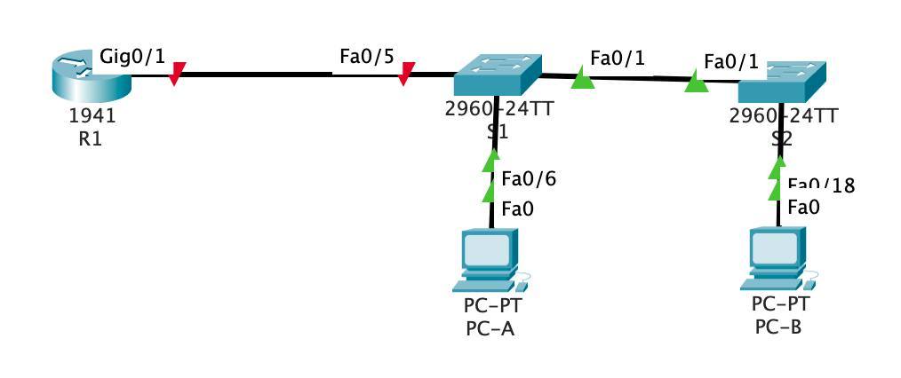

## VLAN

### Цели:
1) Построить топологию Router-on-a-Stick;
2) Настроить маршрутизацию трафика между VLAN'ами.

### Исходная топология:



**Шаг 1. Выполним базовую настройку роутера**
```cli
Router>en
Router#conf t
Enter configuration commands, one per line.  End with CNTL/Z.
Router(config)#hostname R1
R1(config)#no ip doma
R1(config)#no ip domain-lookup
R1(config)#enable secert class
R1(config)#enable secret class
R1(config)#line console 0
R1(config-line)#
R1(config-line)#pass cisco
R1(config-line)#login
R1(config-line)#exit
R1(config)#line vty 0 4
R1(config-line)#pass cisco
R1(config-line)#login
R1(config-line)#exit
R1(config)#service password-encryption
R1(config)#banner motd $ Unauthorized access is prohibited! $
R1#wr
Building configuration...
[OK]
R1#clock set 19:14:00 june 07 2025
R1#sh clock
19:14:3.922 UTC Sat Jun 7 2025
```
**Шаг 2. Выполним базовую настройку коммутатора S1**
```cli
Switch>en
Switch#conf t
Switch(config)#hos
Switch(config)#hostname S1
S1(config)#no ip domain-lookup
S1(config)#enable secret class
S1(config)#line console 0
S1(config-line)#pass cisco
S1(config-line)#login
S1(config-line)#exit
S1(config)#line vty 0 15
S1(config-line)#pass cisco
S1(config-line)#login
S1(config-line)#exit
S1(config)#service password-encryption
S1(config)#banner motd $ Unauthorized access is prohibited! $
S1(config)#exit
S1#clock set 19:16:00 june 07 2025
S1#sh clock
19:16:3.796 UTC Sat Jun 7 2025
S1#wr
Building configuration...
[OK]
```
**Шаг 2. Выполним базовую настройку коммутатора S2**
```cli
Switch>en
Switch#conf t
Switch(config)#hostname S2
S2(config)#no ip domain-lookup
S2(config)#enable secret class
S2(config)#line console 0
S2(config-line)#pass cisco
S2(config-line)#login
S2(config-line)#exit
S2(config)#line vty 0 15
S2(config-line)#pass cisco
S2(config-line)#login
S2(config-line)#exit
S2(config)#service password-encryption
S2(config)#banner motd $ Unauthorized access is prohibited! $
S2(config)#end
S2#clock set 19:20:00 june 07 2025
S2#sh clock
19:20:3.643 UTC Sat Jun 7 2025
S2#wr
Building configuration...
[OK]
```
