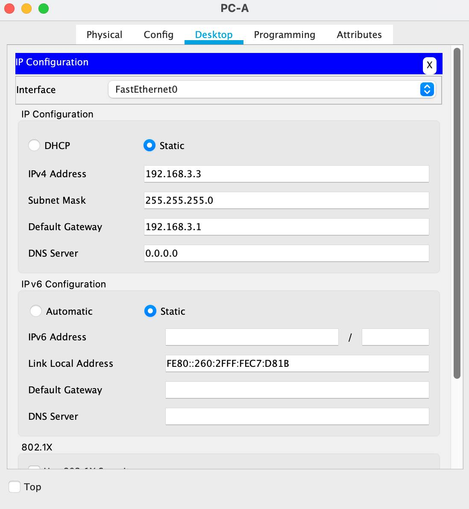
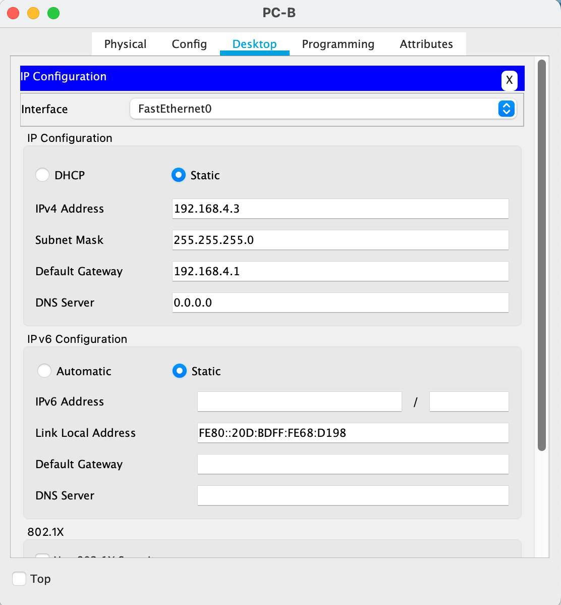
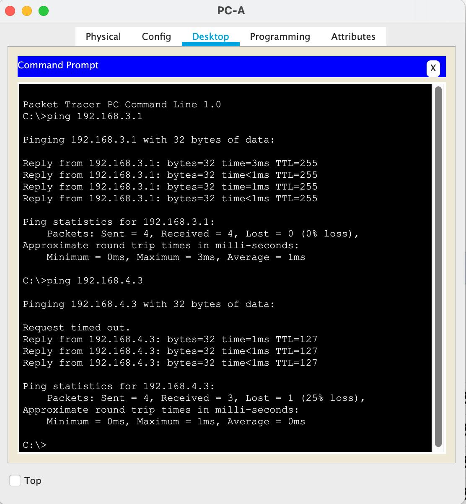
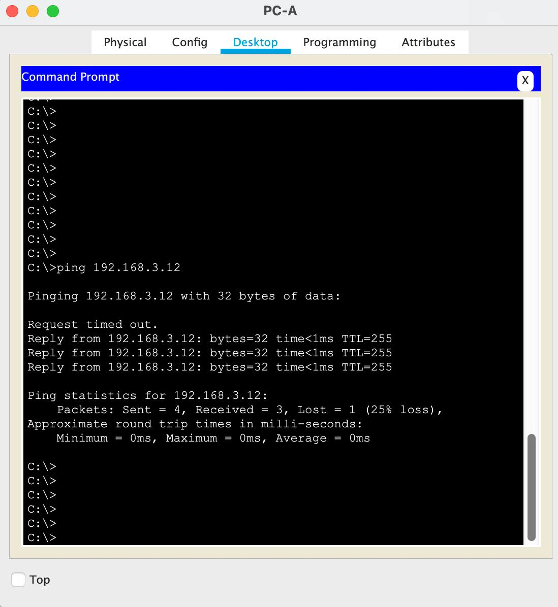

## VLAN

### Цели:
1) Построить топологию Router-on-a-Stick;
2) Настроить маршрутизацию трафика между VLAN'ами.

### Исходная топология:


**Шаг 1. Выполним базовую настройку роутера**
```cli
Router>en
Router#conf t
Enter configuration commands, one per line.  End with CNTL/Z.
Router(config)#hostname R1
R1(config)#no ip doma
R1(config)#no ip domain-lookup
R1(config)#enable secert class
R1(config)#enable secret class
R1(config)#line console 0
R1(config-line)#
R1(config-line)#pass cisco
R1(config-line)#login
R1(config-line)#exit
R1(config)#line vty 0 4
R1(config-line)#pass cisco
R1(config-line)#login
R1(config-line)#exit
R1(config)#service password-encryption
R1(config)#banner motd $ Unauthorized access is prohibited! $
R1#wr
Building configuration...
[OK]
R1#clock set 19:14:00 june 07 2025
R1#sh clock
19:14:3.922 UTC Sat Jun 7 2025
```
**Шаг 2. Выполним базовую настройку коммутатора S1**
```cli
Switch>en
Switch#conf t
Switch(config)#hos
Switch(config)#hostname S1
S1(config)#no ip domain-lookup
S1(config)#enable secret class
S1(config)#line console 0
S1(config-line)#pass cisco
S1(config-line)#login
S1(config-line)#exit
S1(config)#line vty 0 15
S1(config-line)#pass cisco
S1(config-line)#login
S1(config-line)#exit
S1(config)#service password-encryption
S1(config)#banner motd $ Unauthorized access is prohibited! $
S1(config)#exit
S1#clock set 19:16:00 june 07 2025
S1#sh clock
19:16:3.796 UTC Sat Jun 7 2025
S1#wr
Building configuration...
[OK]
```
**Шаг 2. Выполним базовую настройку коммутатора S2**
```cli
Switch>en
Switch#conf t
Switch(config)#hostname S2
S2(config)#no ip domain-lookup
S2(config)#enable secret class
S2(config)#line console 0
S2(config-line)#pass cisco
S2(config-line)#login
S2(config-line)#exit
S2(config)#line vty 0 15
S2(config-line)#pass cisco
S2(config-line)#login
S2(config-line)#exit
S2(config)#service password-encryption
S2(config)#banner motd $ Unauthorized access is prohibited! $
S2(config)#end
S2#clock set 19:20:00 june 07 2025
S2#sh clock
19:20:3.643 UTC Sat Jun 7 2025
S2#wr
Building configuration...
[OK]
```
**Шаг 3. Выполним настройку сетевых интерфейсов PC-A и  PC-B**

Настройка сетевого интерфейса PC-A


Настройка сетевого интерфейса PC-B


**Шаг 4. Выполним сознаие VLAN на S1 и S2**

Настройка VLAN на S1
```cli
S1(config)#vlan 3
S1(config-vlan)#name Management
S1(config-vlan)#vlan 4
S1(config-vlan)#name Operations
S1(config-vlan)#vlan 7
S1(config-vlan)#name ParkingLot
S1(config-vlan)#vlan 8
S1(config-vlan)#name Native
S1(config-vlan)#interface vlan 3
S1(config-if)#ip address 192.168.3.11 255.255.255.0
S1(config-if)#exit
S1(config)#ip default-gateway 192.168.3.1
```
Настройка VLAN на S2
```cli
S2(config)#vlan 3
S2(config-vlan)#name Management
S2(config-vlan)#vlan 4
S2(config-vlan)#name Operations
S2(config-vlan)#vlan 7
S2(config-vlan)#name ParkingLot
S2(config-vlan)#
S2(config-vlan)#vlan 8
S2(config-vlan)#name Native
S2(config-vlan)#exit
S2(config)#interface vlan 3
S2(config-if)# ip address 192.168.3.12 255.255.255.0
S2(config-if)#exit
S2(config)#ip default-gateway 192.168.3.1
```
**Шаг 5. Выполним настройку access-интерфейсов на S1 и S2**

Настройка access-интерфейсов на S1
```cli
S1(config)#
S1(config)#interface range f0/2 - 4 , f0/7 - 24 , g0/1 - 2
S1(config-if-range)#switchport mode access
S1(config-if-range)#switchport access vlan 7
S1(config-if-range)#sh
S1(config-if-range)#interface f0/6
S1(config-if)#switchport mode access
S1(config-if)#switchport access vlan 3
S1(config-if)#do sh vl br

VLAN Name                             Status    Ports
---- -------------------------------- --------- -------------------------------
1    default                          active    Fa0/1, Fa0/5
3    Management                       active    Fa0/6
4    Operations                       active    
7    ParkingLot                       active    Fa0/2, Fa0/3, Fa0/4, Fa0/7
                                                Fa0/8, Fa0/9, Fa0/10, Fa0/11
                                                Fa0/12, Fa0/13, Fa0/14, Fa0/15
                                                Fa0/16, Fa0/17, Fa0/18, Fa0/19
                                                Fa0/20, Fa0/21, Fa0/22, Fa0/23
                                                Fa0/24, Gig0/1, Gig0/2
8    Native                           active    
1002 fddi-default                     active    
1003 token-ring-default               active    
1004 fddinet-default                  active    
1005 trnet-default                    active    
```
Настройка access-интерфейсов на S2
```cli
S2(config)#interface range f0/2 - 17, f0/19 - 24 , g0/1 - 2
S2(config-if-range)#switchport mode access
S2(config-if-range)#switchport access vlan 7
S2(config-if-range)#sh
S2(config-if-range)#interface f0/18
S2(config-if)#switchport mode access
S2(config-if)#switchport access vlan 4
S2(config-if)#do sh vl br

VLAN Name                             Status    Ports
---- -------------------------------- --------- -------------------------------
1    default                          active    Fa0/1
3    Management                       active    
4    Operations                       active    Fa0/18
7    ParkingLot                       active    Fa0/2, Fa0/3, Fa0/4, Fa0/5
                                                Fa0/6, Fa0/7, Fa0/8, Fa0/9
                                                Fa0/10, Fa0/11, Fa0/12, Fa0/13
                                                Fa0/14, Fa0/15, Fa0/16, Fa0/17
                                                Fa0/19, Fa0/20, Fa0/21, Fa0/22
                                                Fa0/23, Fa0/24, Gig0/1, Gig0/2
8    Native                           active    
1002 fddi-default                     active    
1003 token-ring-default               active    
1004 fddinet-default                  active    
1005 trnet-default                    active   
```
**Шаг 6. Выполним настройку trunk-интерфейсов между S1 и S2**

Настройка trunk-интерфейса на S1 в сторону S2
```cli
S1(config)#int f0/1
S1(config-if)#switchport mode trunk
S1(config-if)#switchport trunk native vlan 8
S1(config-if)#switchport trunk allowed vlan 3,4,8
S1(config-if)#
S1(config-if)#do sh int tru
Port        Mode         Encapsulation  Status        Native vlan
Fa0/1       on           802.1q         trunking      8

Port        Vlans allowed on trunk
Fa0/1       3-4,8

Port        Vlans allowed and active in management domain
Fa0/1       3,4,8

Port        Vlans in spanning tree forwarding state and not pruned
Fa0/1       3,4,8
```
Настройка trunk-интерфейса на S2 в сторону S1
```cli
S2(config)#interface f0/1
S2(config-if)#switchport mode trunk
S2(config-if)#switchport trunk native vlan 8
S2(config-if)#switchport trunk allowed vlan 3,4,8
S2(config-if)#
S2(config-if)#do sh int tru
Port        Mode         Encapsulation  Status        Native vlan
Fa0/1       on           802.1q         trunking      8

Port        Vlans allowed on trunk
Fa0/1       3-4,8

Port        Vlans allowed and active in management domain
Fa0/1       3,4,8

Port        Vlans in spanning tree forwarding state and not pruned
Fa0/1       none
```
**Шаг 7. Выполним настройку trunk-интерфейса S1 в сторону R1 и сохраним конфигурацию в startup config на обоих коммутаторах**

Настройка trunk-интерфейса на S1 в сторону R1 и сохранение конфигурации в startup config на S1
```cli
S1(config)#interface f0/5
S1(config-if)#switchport mode trunk
S1(config-if)#switchport trunk native vlan 8
S1(config-if)#switchport trunk allowed vlan 3,4,8
S1(config-if)#do wr
Building configuration...
[OK]
```
Сохранение конфигурации в startup config на S2
```cli
S2(config-if)#do wr
Building configuration...
[OK]
```

[**Why does F0/5 not appear in the list of trunks?**]()
```cli
Потому что интерфейс со стороны R1 находится в состоянии "Admin down"
```
**Шаг 8. Выполним настройку интерфейсов на R1**
```cli
R1(config)#int Gi0/1
R1(config-if)#no sh
R1(config-if)#
R1(config-if)#int Gi0/1.3
R1(config-subif)#
R1(config-subif)#description Management
R1(config-subif)#encapsulation dot1q 3
R1(config-subif)#ip address 192.168.3.1 255.255.255.0
R1(config-subif)#int Gi0/1.4
R1(config-subif)#description Operations
R1(config-subif)#encapsulation dot1q 4
R1(config-subif)#ip address 192.168.4.1 255.255.255.0
R1(config-subif)#int Gi0/1.8
R1(config-subif)#
R1(config-subif)#description Native
R1(config-subif)#encapsulation dot1q 8 native
R1(config-subif)#do sh ip int br
Interface              IP-Address      OK? Method Status                Protocol 
GigabitEthernet0/0     unassigned      YES NVRAM  administratively down down 
GigabitEthernet0/1     unassigned      YES NVRAM  up                    up 
GigabitEthernet0/1.3   192.168.3.1     YES manual up                    up 
GigabitEthernet0/1.4   192.168.4.1     YES manual up                    up 
GigabitEthernet0/1.8   unassigned      YES unset  up                    up 
Vlan1                  unassigned      YES NVRAM  administratively down down
```
**Шаг 9. Проверка сетевой связанности**

Для проверки сетевой связанности между VLAN сделаем ping с PC-A до его шлюза, до PC-В и коммутатора S2.





Как видим, ping выполнен успешно. В cлучае, когда PC-A пинговал PC-В и коммутатора S2, первый пакет был потерян из-за ARP-запроса.

[**From the command prompt on PC-B, issue the tracert command to the address of PC-A. What intermediate IP addresses are shown in the results?**]()
```cli
C:\>tracert 192.168.3.3

Tracing route to 192.168.3.3 over a maximum of 30 hops: 

  1   1 ms      0 ms      0 ms      192.168.4.1
  2   0 ms      0 ms      0 ms      192.168.3.3

Trace complete.

C:\>

Как можно заметить в выводе команды tracert, первым хопом является адрес маршрутизатора на sub-интерфейсе Gi0/1.4, который является шлюзом для РС-В, после чего запрос доходит до РС-А.
```