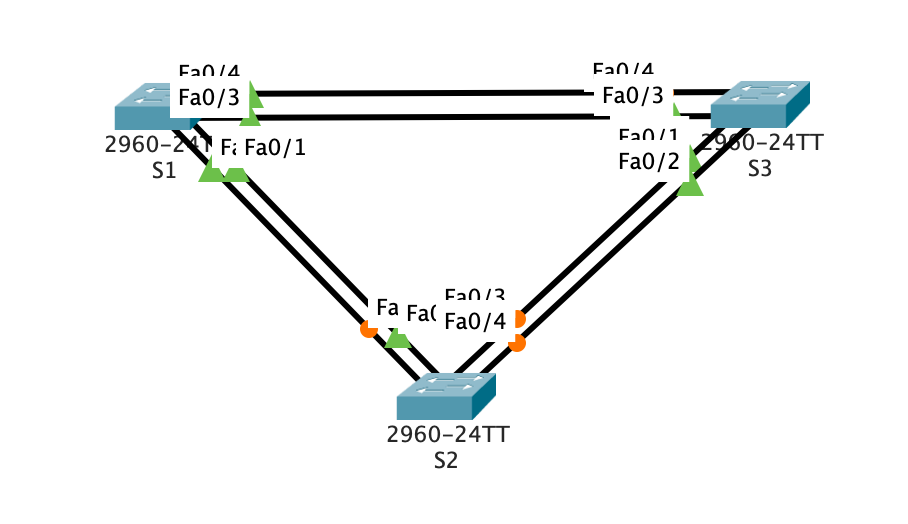

## STP

### Цели:
1) Создание сети и настройка основных параметров устройства, выбор корневого моста;
2) Наблюдение за процессом выбора протоколом STP порта, исходя из стоимости портов;
3) Наблюдение за процессом выбора протоколом STP порта, исходя из приоритета портов.

### Исходная топология:



**Шаг 1. Выполним базовую настройку коммутатора S1**
```cli
Switch#conf t
Switch(config)#hostname S1
S1(config)#no ip domain-lookup
S1(config)#enable secret class
S1(config)#line console 0
S1(config-line)#pass cisco
S1(config-line)#login
S1(config-line)#logging synchronous 
S1(config-line)#line vty 0 15
S1(config-line)#pass cisco
S1(config-line)#login
S1(config-line)#exit
S1(config)#banner motd $ Unauthorized access is prohibited! $
S1(config)#int vlan1
S1(config-if)#ip add
S1(config-if)#ip address 192.168.1.1 255.255.255.0
S1(config-if)#no sh
S1(config-if)#
%LINK-5-CHANGED: Interface Vlan1, changed state to up
S1(config-if)#end
S1#wr
Building configuration...
[OK]
```
**Шаг 2. Выполним базовую настройку коммутатора S2**
```cli
Switch#conf t
Switch(config)#hostname S2
S2(config)#no ip domain-lookup
S2(config)#enable secret class
S2(config)#line console 0
S2(config-line)#pass cisco
S2(config-line)#login
S2(config-line)#logging synchronous 
S2(config-line)#line vty 0 15
S2(config-line)#pass cisco
S2(config-line)#login
S2(config-line)#exit
S2(config)#banner motd $ Unauthorized access is prohibited! $
S2(config)#int vlan1
S2(config-if)#ip add
S2(config-if)#ip address 192.168.1.2 255.255.255.0
S2(config-if)#no sh
S2(config-if)#
%LINK-5-CHANGED: Interface Vlan1, changed state to up
S2(config-if)#end
S2#wr
Building configuration...
[OK]
```
**Шаг 3. Выполним базовую настройку коммутатора S3**
```cli
Switch#conf t
Switch(config)#hostname S3
S3(config)#no ip domain-lookup
S3(config)#enable secret class
S3(config)#line console 0
S3(config-line)#pass cisco
S3(config-line)#login
S3(config-line)#logging synchronous 
S3(config-line)#line vty 0 15
S3(config-line)#pass cisco
S3(config-line)#login
S3(config-line)#exit
S3(config)#banner motd $ Unauthorized access is prohibited! $
S3(config)#int vlan1
S3(config-if)#ip add
S3(config-if)#ip address 192.168.1.3 255.255.255.0
S3(config-if)#no sh
S3(config-if)#
%LINK-5-CHANGED: Interface Vlan1, changed state to up
S3(config-if)#end
S3#wr
Building configuration...
[OK]
```
**Шаг 4. Проверим связь между коммутаторами**

Проверка связи с коммутатора S1
```cli
S1#ping 192.168.1.2

Type escape sequence to abort.
Sending 5, 100-byte ICMP Echos to 192.168.1.2, timeout is 2 seconds:
..!!!
Success rate is 60 percent (3/5), round-trip min/avg/max = 0/1/3 ms

S1#ping 192.168.1.3

Type escape sequence to abort.
Sending 5, 100-byte ICMP Echos to 192.168.1.3, timeout is 2 seconds:
..!!!
Success rate is 60 percent (3/5), round-trip min/avg/max = 0/0/1 ms
```
Проверка связи с коммутатора S2
```
S2#ping 192.168.1.3

Type escape sequence to abort.
Sending 5, 100-byte ICMP Echos to 192.168.1.3, timeout is 2 seconds:
..!!!
Success rate is 60 percent (3/5), round-trip min/avg/max = 0/0/0 ms
```
**Шаг 4. Определим роли коммутаторов**

На S1 отключим все порты кроме f0/2, f0/4 и отобразим данные протокола STP
```
S1(config)#interface range f0/1 - 24, g0/1 - 2
S1(config-if-range)#sh
S1(config-if-range)#interface range f0/2, f0/4
S1(config-if-range)#no sh
S1(config-if-range)#switchport mode trunk
S1(config-if-range)#do sh spanning-tree
VLAN0001
  Spanning tree enabled protocol ieee
  Root ID    Priority    32769
             Address     0001.9773.6507
             This bridge is the root
             Hello Time  2 sec  Max Age 20 sec  Forward Delay 15 sec

  Bridge ID  Priority    32769  (priority 32768 sys-id-ext 1)
             Address     0001.9773.6507
             Hello Time  2 sec  Max Age 20 sec  Forward Delay 15 sec
             Aging Time  20

Interface        Role Sts Cost      Prio.Nbr Type
---------------- ---- --- --------- -------- --------------------------------
Fa0/2            Desg FWD 19        128.2    P2p
Fa0/4            Desg FWD 19        128.4    P2p
```

На S2 отключим все порты кроме f0/2, f0/4 и отобразим данные протокола STP
```
S2(config)#interface range f0/1 - 24, g0/1 - 2
S2(config-if-range)#sh
S2(config-if-range)#interface range f0/2, f0/4
S2(config-if-range)#no sh
S2(config-if-range)#switchport mode trunk
S2(config-if-range)#do sh spanning-tree
VLAN0001
  Spanning tree enabled protocol ieee
  Root ID    Priority    32769
             Address     0001.9773.6507
             Cost        19
             Port        2(FastEthernet0/2)
             Hello Time  2 sec  Max Age 20 sec  Forward Delay 15 sec

  Bridge ID  Priority    32769  (priority 32768 sys-id-ext 1)
             Address     00D0.D311.727A
             Hello Time  2 sec  Max Age 20 sec  Forward Delay 15 sec
             Aging Time  20

Interface        Role Sts Cost      Prio.Nbr Type
---------------- ---- --- --------- -------- --------------------------------
Fa0/2            Root FWD 19        128.2    P2p
Fa0/4            Altn BLK 19        128.4    P2p
```

На S3 отключим все порты кроме f0/2, f0/4 и отобразим данные протокола STP
```
S3(config)#interface range f0/1 - 24, g0/1 - 2
S3(config-if-range)#sh
S3(config-if-range)#interface range f0/2, f0/4
S3(config-if-range)#no sh
S3(config-if-range)#switchport mode trunk
S3(config-if-range)#do sh spanning-tree
VLAN0001
  Spanning tree enabled protocol ieee
  Root ID    Priority    32769
             Address     0001.9773.6507
             Cost        19
             Port        4(FastEthernet0/4)
             Hello Time  2 sec  Max Age 20 sec  Forward Delay 15 sec

  Bridge ID  Priority    32769  (priority 32768 sys-id-ext 1)
             Address     000D.BD53.E106
             Hello Time  2 sec  Max Age 20 sec  Forward Delay 15 sec
             Aging Time  20

Interface        Role Sts Cost      Prio.Nbr Type
---------------- ---- --- --------- -------- --------------------------------
Fa0/2            Desg FWD 19        128.2    P2p
Fa0/4            Root FWD 19        128.4    P2p
```

Далее, запишем роль и состояние активных портов на каждом коммутаторе в топологии.

S1
```
MAC: 0001.9773.6507
Interface F0/1: Admin shutdown
Interface F0/2: Desg
Interface F0/3: Admin shutdown
Interface F0/4: Desg
```
S2
```
MAC: 00D0.D311.727A
Interface F0/1: Admin shutdown
Interface F0/2: Root
Interface F0/3: Admin shutdown
Interface F0/4: Altn
```
S3
```
MAC: 000D.BD53.E106
Interface F0/1: Admin shutdown
Interface F0/2: Desg
Interface F0/3: Admin shutdown
Interface F0/4: Root
```

[**Какой коммутатор является корневым мостом?**]()
```
В моей топологии коммутатор S1 является root-коммутатором
```
[**Почему этот коммутатор был выбран протоколом spanning-tree в качестве корневого моста?**]()
```
Коммутатор S1 (MAC: 0001.9773.6507) является корневым потому что при одинаковых приоритетах он был 
выбран по минимальному MAC-адресу.
```
[**Какие порты на коммутаторе являются корневыми портами?**]()
```
Корневые порты — это порты, выбранные на каждом коммутаторе для достижения корневого коммутатора.

S1: - в моей стопологии это root-коммутатор
S2: Interface F0/2
S3: Interface F0/4
```
[**Какие порты на коммутаторе являются назначенными портами?**]()
```
Designated Port — это некорневой порт моста между сегментами 
сети, принимающий трафик из соответствующего сегмента. 

S1: Interface F0/2, F0/4
S2: - так как по умолчанию коммутатор использует PVST, у него порт Fa0/4
находится в состоянии Alternative
S3: Interface Fa0/2
```
[**Какой порт отображается в качестве альтернативного и в настоящее время заблокирован?**]()
```
Порт Fa0/4 коммутатора S2.
```
[**Почему протокол spanning-tree выбрал этот порт в качестве невыделенного (заблокированного) порта?**]()
```
Данный порт является альтернативным т.к. он является резервным потому что есть более короткий путь к корневому коммутатору.
```
**Шаг 5. Понаблюдаем за процессом выбора протоколом STP порта, исходя из стоимости портов**

Как было показано в предыдущем шаге, коммутатор S2 у интерфейса Fa0/4 имеест состояние Alternative. Изменим стоимость порта Fa0/2, который в данный момент является Root-портом, и посмотрим на изменения
```
S2(config-if)#int Fa0/2 
S2(config-if)#spanning-tree cost 18
S2(config-if)#
S2(config-if)#do sh spa
VLAN0001
  Spanning tree enabled protocol ieee
  Root ID    Priority    32769
             Address     0001.9773.6507
             Cost        19
             Port        2(FastEthernet0/2)
             Hello Time  2 sec  Max Age 20 sec  Forward Delay 15 sec

  Bridge ID  Priority    32769  (priority 32768 sys-id-ext 1)
             Address     00D0.D311.727A
             Hello Time  2 sec  Max Age 20 sec  Forward Delay 15 sec
             Aging Time  20

Interface        Role Sts Cost      Prio.Nbr Type
---------------- ---- --- --------- -------- --------------------------------
Fa0/2            Root FWD 18        128.2    P2p
Fa0/4            Desg FWD 19        128.4    P2p
```
Как можно заметить, после смены приоритета порт Fa0/4 изменил своё состояние на "Designated", посмотрим изменения на коммутаторе S3.
```
S3#sh spa
VLAN0001
  Spanning tree enabled protocol ieee
  Root ID    Priority    32769
             Address     0001.9773.6507
             Cost        19
             Port        4(FastEthernet0/4)
             Hello Time  2 sec  Max Age 20 sec  Forward Delay 15 sec

  Bridge ID  Priority    32769  (priority 32768 sys-id-ext 1)
             Address     000D.BD53.E106
             Hello Time  2 sec  Max Age 20 sec  Forward Delay 15 sec
             Aging Time  20

Interface        Role Sts Cost      Prio.Nbr Type
---------------- ---- --- --------- -------- --------------------------------
Fa0/2            Desg FWD 19        128.2    P2p
Fa0/4            Altn BLK 19        128.4    P2p
```

[**Почему протокол spanning-tree заменяет ранее заблокированный порт на назначенный порт и блокирует порт, который был назначенным портом на другом коммутаторе?**]()
```
Потому что протокол STP выбирает путь с наименьшей стоимостью и делает такой путь до рута альтернативным.
```
Сбросим ручные настройки стоимости и посмотрим на состояние STP
```
S2(config-if)#no spanning-tree cost 18
S2(config-if)#do sh spa
VLAN0001
  Spanning tree enabled protocol ieee
  Root ID    Priority    32769
             Address     0001.9773.6507
             Cost        19
             Port        2(FastEthernet0/2)
             Hello Time  2 sec  Max Age 20 sec  Forward Delay 15 sec

  Bridge ID  Priority    32769  (priority 32768 sys-id-ext 1)
             Address     00D0.D311.727A
             Hello Time  2 sec  Max Age 20 sec  Forward Delay 15 sec
             Aging Time  20

Interface        Role Sts Cost      Prio.Nbr Type
---------------- ---- --- --------- -------- --------------------------------
Fa0/2            Root FWD 19        128.2    P2p
Fa0/4            Altn BLK 19        128.4    P2p
```
**Шаг 6. Понаблюдаем за процессом выбора протоколом STP порта, исходя из приоритета портов**

Включим порты F0/1 и F0/3 на всех коммутаторах.
```
S1(config)#interface range f0/1, f0/3
S1(config-if-range)#no sh
%LINK-5-CHANGED: Interface FastEthernet0/1, changed state to down
%LINK-5-CHANGED: Interface FastEthernet0/3, changed state to down
```
```
S2(config)#interface range f0/1, f0/3
S2(config-if-range)#no sh
%LINK-5-CHANGED: Interface FastEthernet0/3, changed state to down
S2(config-if-range)#
%LINK-5-CHANGED: Interface FastEthernet0/1, changed state to up
%LINEPROTO-5-UPDOWN: Line protocol on Interface FastEthernet0/1, changed state to up
%LINEPROTO-5-UPDOWN: Line protocol on Interface FastEthernet0/1, changed state to down
%LINEPROTO-5-UPDOWN: Line protocol on Interface FastEthernet0/1, changed state to up
```

```
S3(config)#interface range f0/1, f0/3
S3(config-if-range)#no sh
S3(config-if-range)#
%LINK-5-CHANGED: Interface FastEthernet0/1, changed state to up
%LINEPROTO-5-UPDOWN: Line protocol on Interface FastEthernet0/1, changed state to up
%LINK-5-CHANGED: Interface FastEthernet0/3, changed state to up
%LINEPROTO-5-UPDOWN: Line protocol on Interface FastEthernet0/3, changed state to up
```
Далее, посмотрим на состояние портов некорневого моста.
```
S2#sh spa
VLAN0001
  Spanning tree enabled protocol ieee
  Root ID    Priority    32769
             Address     0001.9773.6507
             Cost        19
             Port        1(FastEthernet0/1)
             Hello Time  2 sec  Max Age 20 sec  Forward Delay 15 sec

  Bridge ID  Priority    32769  (priority 32768 sys-id-ext 1)
             Address     00D0.D311.727A
             Hello Time  2 sec  Max Age 20 sec  Forward Delay 15 sec
             Aging Time  20

Interface        Role Sts Cost      Prio.Nbr Type
---------------- ---- --- --------- -------- --------------------------------
Fa0/1            Root FWD 19        128.1    P2p
Fa0/3            Altn BLK 19        128.3    P2p
Fa0/2            Altn BLK 19        128.2    P2p
Fa0/4            Altn BLK 19        128.4    P2p
```

```
S3#sh spa
VLAN0001
  Spanning tree enabled protocol ieee
  Root ID    Priority    32769
             Address     0001.9773.6507
             Cost        19
             Port        3(FastEthernet0/3)
             Hello Time  2 sec  Max Age 20 sec  Forward Delay 15 sec

  Bridge ID  Priority    32769  (priority 32768 sys-id-ext 1)
             Address     000D.BD53.E106
             Hello Time  2 sec  Max Age 20 sec  Forward Delay 15 sec
             Aging Time  20

Interface        Role Sts Cost      Prio.Nbr Type
---------------- ---- --- --------- -------- --------------------------------
Fa0/1            Desg FWD 19        128.1    P2p
Fa0/2            Desg FWD 19        128.2    P2p
Fa0/3            Root FWD 19        128.3    P2p
Fa0/4            Altn BLK 19        128.4    P2p
```
[**Какой порт выбран протоколом STP в качестве порта корневого моста на каждом коммутаторе некорневого моста?**]()
```
На S2 это порт Fa0/1, на коммутаторе S3 это порт Fa0/3 
```
[**Почему протокол STP выбрал эти порты в качестве портов корневого моста на этих коммутаторах?**]()
```
Потому что они напрямую подключены в корневой коммутатор и имеют наименьший номер по порядку.
```
### Вопросы для повторения
[**1.	Какое значение протокол STP использует первым после выбора корневого моста, чтобы определить выбор порта?**]()
```
После выбора корневого моста протокол STP использует значения стоимости пути (path cost) для определения выбора порта.
```
[**2.	Если первое значение на двух портах одинаково, какое следующее значение будет использовать протокол STP при выборе порта?**]()
```
Далее он будет сравнивать Bridge ID и выберет с наименьшим значением.
```
[**3.	Если оба значения на двух портах равны, каким будет следующее значение, которое использует протокол STP при выборе порта?**]()
```
Далее STP будет сравнивать идентификатор порта и выберет с наименьшим значением.
```