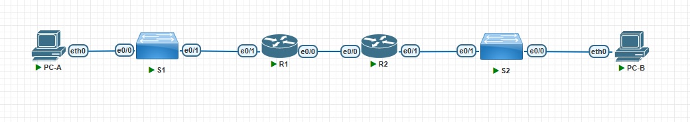

## DHCPv4/v6 и SLAAC

### Цели:
1) Построение сети и настройка основных параметров устройства;
2) Настройка и проверка двух DHCPv4-серверов на R1;
3) Настройка и проверка DHCP-ретранслятора на R2;
4) Проверка назначения адреса SLAAC с R1;
5) Настройка и проверка DHCPv6-сервера без сохранения состояния на R1;
6) Настройка и проверка DHCPv6-сервера с сохранением состояния на R1;
7) Настройка и проверка реле DHCPv6 на R2.

### DHCPv4
### Исходная топология:



### Заполненная таблица адресации:


**Шаг 1. Разработка схема адресации**

Для начала расссчитаем адресацию для подсети А, где должно быть 58 хостов (клиентская VLAN на R1). Для данной задачи нам подойдёт 26 маска. Получается, что подсеть А будет иметь вид: **192.168.1.0/26**.

Далее, рассчитаем адресацию для подсети B, где должно быть 28 хостов (сеть управления VLAN на R1). Для данной задачи нам подойдёт 27 маска. Получается, что подсеть А будет иметь вид: **192.168.1.64/27**.

После этого, рассчитаем адресацию для подсети С, где должно быть 12 хостов (клиентская сеть на R2). Для данной задачи нам подойдёт 28 маска. Получается, что подсеть А будет иметь вид: **192.168.1.96/28**.

**Шаг 2. Выполним базовую настройку роутеров R1 и R2**
```
Router(config)#hostname R1
R1(config)#no ip domain-lookup
R1(config)#enable secret class
R1(config)#line console 0
R1(config-line)#pass cisco
R1(config-line)#login
R1(config-line)#line vty 0 4  
R1(config-line)#pass cisco
R1(config-line)#login
R1(config-line)#exit
R1(config)#service password-encryption
R1(config)#banner motd $ Unauthorized access is prohibited! $
R1(config)#exit
R1#wr
Building configuration...
[OK]
R1#clock set 20:01:00 june 21 2025                            
R1#sh clock
20:01:11.565 UTC Sat Jun 21 2025
```

```
Router(config)#hostname R2
R2(config)#no ip domain-lookup
R2(config)#enable secret class
R2(config)#line console 0
R2(config-line)#pass cisco
R2(config-line)#login
R2(config-line)#line vty 0 4  
R2(config-line)#pass cisco
R2(config-line)#login
R2(config-line)#exit
R2(config)#service password-encryption
R2(config)#banner motd $ Unauthorized access is prohibited! $
R2(config)#exit
R2#wr
Building configuration...
[OK]
R2#clock set 20:05:00 june 21 2025                            
R2#sh clock
20:05:10.565 UTC Sat Jun 21 2025
```

**Шаг 3. Выполним настройку интерфейсов на R1**
```
R1(config)#int Ethernet0/1
R1(config-if)#no sh
R1(config-if)#int Ethernet0/1.100
R1(config-subif)#des
R1(config-subif)#description Clients
R1(config-subif)#encapsulation dot1q 100
R1(config-subif)#ip address 192.168.1.1 255.255.255.192
R1(config-subif)#
R1(config-subif)#int Ethernet0/1.200                   
R1(config-subif)#encapsulation dot1q 200
R1(config-subif)#description Management        
R1(config-subif)#ip address 192.168.1.65 255.255.255.224
R1(config-subif)#int Ethernet0/1.1000                   
R1(config-subif)#description Native                     
R1(config-subif)#encapsulation dot1q 1000 native
R1(config-subif)# int Ethernet0/0 
R1(config-if)#ip add 10.0.0.1 255.255.255.252
R1(config-if)#no sh
R1(config-if)#
R1(config-if)#end
R1#show ip interface brief
Interface                  IP-Address      OK? Method Status                Protocol
Ethernet0/0                10.0.0.1        YES manual up                    up      
Ethernet0/1                unassigned      YES unset  up                    up      
Ethernet0/1.100            192.168.1.1     YES manual up                    up      
Ethernet0/1.200            192.168.1.65    YES manual up                    up      
Ethernet0/1.1000           unassigned      YES unset  up                    up      
Ethernet0/2                unassigned      YES unset  administratively down down    
Ethernet0/3                unassigned      YES unset  administratively down down 
```

**Шаг 4. Выполним настройку интерфейсов на R2**
```
R2(config)#int Ethernet0/0 
R2(config-if)#ip add 10.0.0.2 255.255.255.252
R2(config-if)#no sh
R2(config-if)#int Ethernet0/1
R2(config-if)#ip add 192.168.1.97 255.255.255.240
R2(config-if)#no sh
R2(config-if)#do show ip interface brief
Interface                  IP-Address      OK? Method Status                Protocol
Ethernet0/0                10.0.0.2        YES manual up                    up      
Ethernet0/1                192.168.1.97    YES manual up                    up      
Ethernet0/2                unassigned      YES unset  administratively down down    
Ethernet0/3                unassigned      YES unset  administratively down down  
```
**Шаг 5. Выполним настройку маршрутов по умолчанию на R1 и R2**
```
R1(config)#ip route 0.0.0.0 0.0.0.0 10.0.0.2
R1(config)#do ping 192.168.1.97     
Type escape sequence to abort.
Sending 5, 100-byte ICMP Echos to 192.168.1.97, timeout is 2 seconds:
!!!!!
Success rate is 100 percent (5/5), round-trip min/avg/max = 1/1/1 ms
R1(config-if)#do wr
Building configuration...
[OK]
```

```
R2(config)#ip route 0.0.0.0 0.0.0.0 10.0.0.1
R2(config)#do ping 192.168.1.1 
Type escape sequence to abort.
Sending 5, 100-byte ICMP Echos to 192.168.1.1, timeout is 2 seconds:
!!!!!
Success rate is 100 percent (5/5), round-trip min/avg/max = 1/1/1 ms
R2(config-if)#do wr
Building configuration...
[OK]
```

**Шаг 6. Выполним базовую настройку коммутаторов S1 и S2**
```
Switch(config)#hostname S1
S1(config)#no ip domain-lookup
S1(config)#enable secret class
S1(config)#line console 0
S1(config-line)#pass cisco
S1(config-line)#login
S1(config-line)#line vty 0 4
S1(config-line)#pass cisco  
S1(config-line)#login     
S1(config-line)#exit
S1(config)#service password-encryption
S1(config)#banner motd $ Unauthorized access is prohibited! $
S1(config)#do wr
Building configuration...
Compressed configuration from 978 bytes to 695 bytes[OK]
S1(config)#do clock set 20:15:00 june 21 2025 
S1(config)#do sh clock
20:15:03.465 UTC Sat Jun 21 2025
```

```
Switch(config)#hostname S2
S2(config)#no ip domain-lookup
S2(config)#enable secret class
S2(config)#line console 0
S2(config-line)#pass cisco
S2(config-line)#login
S2(config-line)#line vty 0 4
S2(config-line)#pass cisco  
S2(config-line)#login     
S2(config-line)#exit
S2(config)#service password-encryption
S2(config)#banner motd $ Unauthorized access is prohibited! $
S2(config)#do wr
Building configuration...
Compressed configuration from 978 bytes to 695 bytes[OK]
S2(config)#do clock set 20:20:00 june 21 2025 
S2(config)#do sh clock
20:20:03.465 UTC Sat Jun 21 2025
```

**Шаг 7. Выполним настройку VLAN'ов на S1 и S2**
```
S1(config)#do sh int des
Interface                      Status         Protocol Description
Et0/0                          up             up       
Et0/1                          up             up       
Et0/2                          up             up       
Et0/3                          up             up       
S1(config)#
S1(config)#vlan 100
S1(config-vlan)#name Clients
S1(config-vlan)#vlan 200
S1(config-vlan)#name Management
S1(config-vlan)#vlan 999
S1(config-vlan)#name Parking_Lot
S1(config-vlan)#vlan 1000
S1(config-vlan)#name Native
S1(config-vlan)#
S1(config-vlan)#int vlan 200
S1(config-if)#ip address 192.168.1.66 255.255.255.224
S1(config-if)#no sh
S1(config-if)#ex
S1(config-if)#exit
S1(config)#ip default-gateway 192.168.1.65
S1(config)#int range Ethernet0/2 - 3
S1(config-if-range)#sw m a
S1(config-if-range)#sw a v 999
S1(config-if-range)#sh
S1(config-if-range)#int Ethernet0/0 
S1(config-if)#sw m a
S1(config-if)#sw a v 100
S1(config-if)#
S1(config-if)#do sh vl br

VLAN Name                             Status    Ports
---- -------------------------------- --------- -------------------------------
1    default                          active    Et0/1
100  Clients                          active    Et0/0
200  Management                       active    
999  Parking_Lot                      active    Et0/2, Et0/3
1000 Native                           active    
1002 fddi-default                     act/unsup 
1003 token-ring-default               act/unsup 
1004 fddinet-default                  act/unsup 
1005 trnet-default                    act/unsup 
```

```
S2(config)#do sh int des
Interface                      Status         Protocol Description
Et0/0                          up             up       
Et0/1                          up             up       
Et0/2                          up             up       
Et0/3                          up             up
S2(config)#interface vlan 1
S2(config-if)#ip address 192.168.1.98 255.255.255.240
S2(config-if)#no sh
S2(config-if)#ex
S2(config)#ip default-gateway 192.168.1.97
S2(config)#int range Ethernet0/2 - 3
S2(config-if-range)#sw m a
S2(config-if-range)#sh
```
[**Why is interface F0/5 listed under VLAN 1?**]()
```
Потому что все интерфейс по умодчанию находятся в VLAN 1. В моём случае это интерфейс Et0/1.
```
**Шаг 8. На S1 сконфигурируем магистральный порт**
```
S1(config)#int Ethernet0/1
S1(config-if)#switchport trunk encapsulation dot1q
S1(config-if)#switchport mode trunk               
S1(config-if)#switchport trunk native vlan 1000
S1(config-if)#switchport trunk allowed vlan 100,200,1000
S1(config-if)#do wr
Building configuration...
Compressed configuration from 1447 bytes to 963 bytes[OK]
S1(config-if)#do show interfaces trunk

Port        Mode             Encapsulation  Status        Native vlan
Et0/1       on               802.1q         trunking      1000

Port        Vlans allowed on trunk
Et0/1       100,200,1000

Port        Vlans allowed and active in management domain
Et0/1       100,200,1000

Port        Vlans in spanning tree forwarding state and not pruned
Et0/1       100,200,1000
```
[**At this point, what IP address would the PC’s have if they were connected to the network using DHCP?**]()
```
У него был бы адрес из сети 169.254.x.x (APIPA-адрес)
```
**Шаг 9. На R1 и R2 насроем DHCPv4-сервер**
```
R1(config)#ip dhcp excluded-address 192.168.1.1 192.168.1.5
R1(config)#ip dhcp pool R1_Client_LAN
R1(dhcp-config)#network 192.168.1.0 255.255.255.192
R1(dhcp-config)#domain-name ccna-lab.com
R1(dhcp-config)#default-router 192.168.1.1
R1(dhcp-config)#lease 2 12 30
R1(dhcp-config)#ip dhcp excluded-address 192.168.1.97 192.168.1.101
R1(config)#ip dhcp pool R2_Client_LAN
R1(dhcp-config)#network 192.168.1.96 255.255.255.240
R1(dhcp-config)#default-router 192.168.1.97
R1(dhcp-config)#domain-name ccna-lab.com
R1(dhcp-config)#lease 2 12 30
R1(dhcp-config)#
R1(dhcp-config)#do wr
Building configuration...
[OK]
```

```
R2(config)#int Ethernet0/1 
R2(config-if)#ip helper-address 10.0.0.1
R2(config-if)#
R2(config-if)#do wr
Building configuration...
[OK]
```

**Шаг 10. На PC-A и PC-B запросим конфигурацию с DHCP-сервера и посмотрим информацию о назначенных арендах**
```
PC-A> ip dhcp
DDORA IP 192.168.1.6/26 GW 192.168.1.1

PC-A> show ip

NAME        : VPCS[1]
IP/MASK     : 192.168.1.6/26
GATEWAY     : 192.168.1.1
DNS         : 
DHCP SERVER : 192.168.1.1
DHCP LEASE  : 217793, 217800/108900/190575
DOMAIN NAME : ccna-lab.com
MAC         : 00:50:79:66:68:65
LPORT       : 20000
RHOST:PORT  : 127.0.0.1:30000
MTU         : 1500
```

```
PC-B> ip dhcp
DDORA IP 192.168.1.102/28 GW 192.168.1.97

PC-B> show ip

NAME        : VPCS[1]
IP/MASK     : 192.168.1.102/28
GATEWAY     : 192.168.1.97
DNS         : 
DHCP SERVER : 10.0.0.1
DHCP LEASE  : 217796, 217800/108900/190575
DOMAIN NAME : ccna-lab.com
MAC         : 00:50:79:66:68:6a
LPORT       : 20000
RHOST:PORT  : 127.0.0.1:30000
MTU         : 1500
```

```
R1(config)#do show ip dhcp binding 
Bindings from all pools not associated with VRF:
IP address          Client-ID/     Lease expiration        Type
    Hardware address/
    User name
192.168.1.6         0100.5079.6668.65       Jun 24 2025 09:49 AM    Automatic
192.168.1.102       0100.5079.6668.6a       Jun 24 2025 09:58 AM    Automatic
```