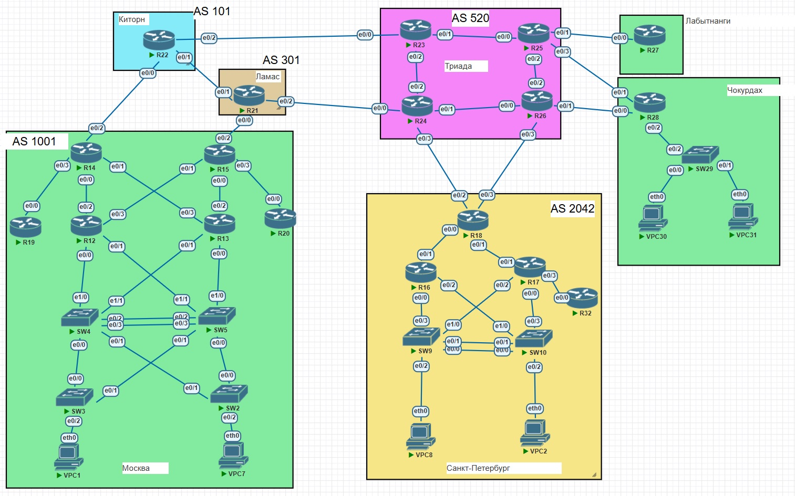

## Проектирование сети (IPv6)

### Цели:
1) Распланировать адресное пространство. Я буду делать на IPv6;
2) Настроить IP на всех активных портах для дальнейшей работы над проектом;
3) Настроить VLAN/Loopbackup interface управления для сетевых устройств;
4) Настроить каждый VPC в каждом офисе в своем VLAN;
5) Настроить сети офисов так, чтобы не возникало broadcast штормов, а использование линков было максимально оптимизировано.

**Шаг 1. Распланируем адресное пространство**<br>

### Топология сети:



### Общий IP-план топологии:

| Site             | IPv6 Site Subnet      | IPv6 link-local address   |
|------------------|-----------------------|-----------------------------|
| Москва           | 2001:2025:1111::/48   | fe80:1111::/64 
| Чокурдах         | 2001:2025:2222::/48   | fe80:2222::/64
| Санкт-Петербург  | 2001:2025:3333::/48   | fe80:3333::/64
| Триада           | 2001:2025:4444::/48   | fe80:4444::/64
| Лабытнанги       | Only point-to-point   | fe80:5555::/64
| Киторн           | Only point-to-point   | fe80:6666::/64
| Ламас            | Only point-to-point   | fe80:7777::/64
| Loopback         | 2001:dead:beef:0001::/64 |

### IP-план Москвы:

| Device           | Interface - IPv6 address      | IPv6 link-local address  |
|------------------|-----------------------|-----------------------------|
| R12              | int vlan10 - 2001:2025:1111:0010::1/64 (HSRP 2001:2025:1111:0010::ffff/64) <br> int vlan20 - 2001:2025:1111:0020::1/64 (HSRP 2001:2025:1111:0020::ffff/64) <br> int vlan100 - 2001:2025:1111:0100::1/64 <br> e0/2 - 2001:2025:1111:0002::1/127 <br> e0/3 - 2001:2025:1111:0003::1/127 <br > lo1 - 2001:dead:beef::1/128 | fe80:1111::1/64 <br> HSRP - FE80:1111::FFFF
| R13              | int vlan10 - 2001:2025:1111:0010::2/64 (HSRP 2001:2025:1111:0010::ffff/64) <br> int vlan20 - 2001:2025:1111:0020::2/64 (HSRP 2001:2025:1111:0020::ffff/64) <br> int vlan100 - 2001:2025:1111:0100::2/64 <br> e0/2 - 2001:2025:1111:0004::1/127 <br> e0/3 - 2001:2025:1111:0005::1/127 <br > lo1 - 2001:dead:beef::2/128   | fe80:1111::2/64 <br> HSRP - FE80:1111::FFFF
| R14              | e0/0 - 2001:2025:1111:0002::/127 <br> e0/1 - 2001:2025:1111:0005::/127 <br> e0/2 - 2001:2025:abcd:ff00::/127 <br> e0/3 - 2001:2025:1111:0006::1/127 <br > e1/0 - 2001:2025:1111:0008::/127 <br >lo1 - 2001:dead:beef::3/128 | fe80:1111::3/64 <br> e0/2 - fe80:6666::2/64 -> R22
| R15              | e0/0 - 2001:2025:1111:0004::/127 <br> e0/1 - 2001:2025:1111:0003::/127 <br> e0/2 - 2001:2025:abcd:ff03::/127 <br> e0/3 - 2001:2025:1111:0007::1/127 <br > e1/0 - 2001:2025:1111:0008::1/127 <br >lo1 - 2001:dead:beef::4/128  | fe80:1111::4/64  <br> e0/2 - fe80:7777::3/64 -> R21
| R19              | e0/0 - 2001:2025:1111:0006::/127 <br >lo1 - 2001:dead:beef::5/128 | fe80:1111::5/64 
| R20              | e0/0 - 2001:2025:1111:0007::/127 <br >lo1 - 2001:dead:beef::6/128 | fe80:1111::6/64 
| SW2              | int vlan100 (mgmt) - 2001:2025:1111:0100::3/64 | fe80:1111::7/64 
| SW3              | int vlan100 (mgmt) - 2001:2025:1111:0100::4/64 | fe80:1111::8/64 
| SW4              | int vlan100 (mgmt) - 2001:2025:1111:0100::5/64 | fe80:1111::9/64 
| SW5              | int vlan100 (mgmt) - 2001:2025:1111:0100::6/64 | fe80:1111::10/64 
| VPC1             | SLAAC | SLAAC
| VPC7             | SLAAC | SLAAC

### IP-план Чокурдаха:

| Device           | Interface - IPv6 address      | IPv6 link-local address   |
|------------------|-----------------------|-----------------------------|
| R28              | e0/0 - 2001:2025:abcd:ff08::/127 <br> e0/1 - 2001:2025:abcd:ff07::/127  <br> int vlan50 - 2001:2025:2222:0050::1/64 <br> int vlan60 - 2001:2025:2222:0060::1/64 <br> int vlan300 - 2001:2025:2222:0300::1/64 <br >lo1 - 2001:dead:beef::7/128  | fe80:2222::3/64
| SW29              | int vlan300 (mgmt) - 2001:2025:2222:0300::2/64 | fe80:2222::4/64
| VPC30            | SLAAC | SLAAC
| VPC31            | SLAAC | SLAAC

### IP-план Санкт-Петербурга:

| Device           | Interface - IPv6 address      | IPv6 link-local address   |
|------------------|-----------------------|-----------------------------|
| R16              | e0/1 -  2001:2025:3333:0010::/127 <br>  int vlan30 - 2001:2025:3333:0030::1/64 (HSRP 2001:2025:3333:30::FFFF/64)   <br> int vlan40 - 2001:2025:3333:0040::1/64  (HSRP 2001:2025:3333:40::FFFF/64)  <br> int vlan200 - 2001:2025:3333:0200::1/64 <br >lo1 - 2001:dead:beef::8/128  | fe80:3333::4/64 <br> HSRP - FE80:3333::FFFF
| R17              | e0/1 -  2001:2025:3333:0020::/127 <br> e0/3 -  2001:2025:3333:0030::1/127 <br>  int vlan30 - 2001:2025:3333:0030::2/64 (HSRP 2001:2025:3333:30::FFFF/64)    <br> int vlan40 - 2001:2025:3333:0050::1/64 (HSRP 2001:2025:3333:40::FFFF/64)  <br> int vlan200 - 2001:2025:3333:0300::2/64 <br >lo1 - 2001:dead:beef::9/128  | fe80:3333::5/64 <br> HSRP - FE80:3333::FFFF
| R18              | e0/0 - 2001:2025:3333:0010::1/127 <br> e0/1 - 2001:2025:3333:0020::1/127  <br> e0/2 - 2001:2025:abcd:ff05::/127 <br> e0/3 - 2001:2025:abcd:ff09::/127 <br >lo1 - 2001:dead:beef::10/128  | fe80:3333::3/64
| R32              | e0/0 -  2001:2025:3333:0050::/127 <br >lo1 - 2001:dead:beef::11/128 | fe80:3333::6/64
| SW9              | int vlan200 (mgmt) - 2001:2025:3333:0200::3/64 | fe80:3333::7/64
| SW10              | int vlan200 (mgmt) - 2001:2025:3333:0200::4/64 | fe80:3333::8/64
| VPC2            | SLAAC | SLAAC
| VPC8            | SLAAC | SLAAC

### IP-план Триады:

| Device           | Interface - IPv6 address      | IPv6 link-local address   |
|------------------|-----------------------|-----------------------------|
| R23              | e0/0 - 2001:2025:abcd:ff02::1/127  <br> e0/1 - 2001:2025:4444:0001::1/127 <br> e0/2 - 2001:2025:4444:0002::1/127 <br >lo1 - 2001:dead:beef::12/128  | fe80:4444::3/64
| R24              | e0/0 - 2001:2025:abcd:ff04::1/127 <br> e0/1 - 2001:2025:4444:0003::1/127  <br> e0/2 - 2001:2025:4444:0002::/127 <br> e0/3 - 2001:2025:abcd:ff05::1/127 <br >lo1 - 2001:dead:beef::13/128 | fe80:4444::4/64 <br> e0/3 - fe80:3333::1/64 -> R18
| R25              | e0/0 - 2001:2025:4444:0001::/127 <br> e0/1 - 2001:2025:abcd:ff06::1/127 <br> e0/2 - 2001:2025:4444:0004::1/127 <br> e0/3 - 2001:2025:abcd:ff07::1/127 <br >lo1 - 2001:dead:beef::14/128   | fe80:4444::5/64 <br> e0/1 - fe80:5555::1/64 -> R27  <br> e0/3 - fe80:2222::1/64 -> R28
| R26              | e0/0 - 2001:2025:4444:0003::/127 <br> e0/1 - 2001:2025:abcd:ff08::1/127  <br> e0/2 - 2001:2025:4444:0004::/127 <br> e0/3 - 2001:2025:abcd:ff09::1/127 <br >lo1 - 2001:dead:beef::15/128  |  fe80:4444::6/64 <br> e0/1 - fe80:2222::2/64 -> R28 <br> e0/3 - fe80:3333::2/64 -> R18

### IP-план Лабытнанги:

| Device           | Interface - IPv6 address      | IPv6 link-local address   |
|------------------|-----------------------|-----------------------------|
| R27              | e0/0 - 2001:2025:abcd:ff06::/127 <br >lo1 - 2001:dead:beef::16/128 | fe80:5555::2/64 -> R25

### IP-план Киторна:

| Device           | Interface - IPv6 address      | IPv6 link-local address   |
|------------------|-----------------------|-----------------------------|
| R22              | e0/0 - 2001:2025:abcd:ff00::1/127 <br> e0/1 - 2001:2025:abcd:ff01::/127 <br> e0/2 - 2001:2025:abcd:ff02::/127 <br >lo1 - 2001:dead:beef::17/128  | e0/0 - fe80:6666::1/64 -> R14 <br> e0/1 - fe80:7777::2/64 -> R21 <br> e0/2 - fe80:4444::1/64 -> R23 <br>

### IP-план Ламаса:

| Device           | Interface - IPv6 address      | IPv6 link-local address   |
|------------------|-----------------------|-----------------------------|
| R21              | e0/0 - 2001:2025:abcd:ff03::1/127 <br> e0/1 - 2001:2025:abcd:ff01::1/127 <br> e0/2 - 2001:2025:abcd:ff04::/127 <br >lo1 - 2001:dead:beef::18/128  | e0/0 - fe80:7777::1/64 -> R15 <br> e0/1 - fe80:7777::1/64 -> R22 <br> e0/2 - fe80:4444::2/64 -> R23 


**Шаг 2. Настроите ip адреса на каждом активном порту**<br>
Выше я распланировал и подробно расписал адресное пространство. Не вижу смысла явно показывать, как я захожу на каждую железку и делаю:
```
ipv6 address ... link-local
ipv6 address ... 
no shutdown
exit
ipv6 unicast-routing
```

**Шаг 3. Настроите сети офисов так, чтобы не возникало broadcast штормов, а использование линков было максимально оптимизировано**<br>
Сначала я хотел настроить VPC на коммутаторах распределения, но в моих образах данная настройка не поддерживается ;(
Поэтому в Москве между SW4 и SW5 я настроил Port-channel.
```
SW4(config)#vlan 666
SW4(config-vlan)#name native
SW4(config-vlan)#vlan 100
SW4(config-vlan)#name mgmt
SW4(config-vlan)#vlan 10
SW4(config-vlan)#vlan 20
SW4(config-vlan)#exit
SW4(config)#interface range Et0/2 , Et0/3
SW4(config-if-range)#channel-protocol lacp 
SW4(config-if-range)#channel-group 1 mode active
SW4(config-if-range)#exit
SW4(config)#int Po1
SW4(config-if)#switchport trunk encapsulation dot1q
SW4(config-if)#switchport mode trunk
SW4(config-if)#switchport trunk native vlan 666
SW4(config-if)#switchport trunk allowed vlan add 10,20,100,666
```

```
SW5(config)#vlan 666
SW5(config-vlan)#name native
SW5(config-vlan)#vlan 100
SW5(config-vlan)#name mgmt
SW5(config-vlan)#vlan 10
SW5(config-vlan)#vlan 20
SW5(config-vlan)#exit
SW5(config)#interface range Et0/2 , Et0/3
SW5(config-if-range)#channel-protocol lacp 
SW5(config-if-range)#channel-group 1 mode active
SW5(config-if-range)#exit
SW5(config)#int Po1
SW5(config-if)#switchport trunk encapsulation dot1q
SW5(config-if)#switchport mode trunk
SW5(config-if)#switchport trunk native vlan 666
SW5(config-if)#switchport trunk allowed vlan add 10,20,100,666
```

Далее, настраиваем Trunk в сторону SW3 и SW2
```
SW4(config)#int range Et0/0 , Et0/1
SW4(config-if-range)#switchport trunk encapsulation dot1q
SW4(config-if-range)#switchport mode trunk               
SW4(config-if-range)#switchport trunk native vlan 666
SW4(config-if)#switchport trunk allowed vlan add 10,20,100,666
```

```
SW5(config)#int range Et0/0 , Et0/1
SW5(config-if-range)#switchport trunk encapsulation dot1q
SW5(config-if-range)#switchport mode trunk 
SW5(config-if-range)#switchport trunk native vlan 666
SW5(config-if)#switchport trunk allowed vlan add 10,20,100,666
```
```
SW2(config)#vlan 666
SW2(config-vlan)#name native
SW2(config-vlan)#vlan 100
SW2(config-vlan)#name mgmt
SW2(config-vlan)#vlan 10
SW2(config-vlan)#vlan 20
SW2(config-vlan)#exit
SW2(config)#int range Et0/0, Et0/1
SW2(config-if-range)#switchport trunk encapsulation dot1q
SW2(config-if-range)#switchport mode trunk   
SW2(config-if-range)#switchport trunk native vlan 666
SW2(config-if)#switchport trunk allowed vlan add 10,20,100,666
```
```
SW3(config)#vlan 666
SW3(config-vlan)#name native
SW3(config-vlan)#vlan 100
SW3(config-vlan)#name mgmt
SW3(config-vlan)#vlan 10
SW2(config-vlan)#vlan 20
SW3(config-vlan)#exit
SW3(config)#int range Et0/0, Et0/1
SW3(config-if-range)#switchport trunk encapsulation dot1q
SW3(config-if-range)#switchport mode trunk   
SW3(config-if-range)#switchport trunk native vlan 666
SW3(config-if)#switchport trunk allowed vlan add 10,20,100,666
```

Затем, настроим rapid-pvst, включаем его на всех коммутаторах. В Москве я хочу, чтобы ROOT-коммутатором в VLAN 10,100,66 был SW4, следующим по значимости будет SW5, а для VLAN 20 ROOT будет SW5.
```
SW4(config)#spanning-tree mode rapid-pvst 
SW4(config)#spanning-tree vlan 10,100,666 priority 0
SW4(config)#spanning-tree vlan 20 priority 4096
```

```
SW5(config)#spanning-tree mode rapid-pvst 
SW5(config)#spanning-tree vlan 20 priority 0
SW5(config)#spanning-tree vlan 10,100,666 priority 4096
```

Далее, настроим HSRP на R12 и R13 и DHCP для получения конфигурации по SLAAC на VPC1 в VLAN10. Роутер R12 будет Active, R13 Standby.
```
R12(config)#ipv6 dhcp pool OTUS-vlan10
R12(config-dhcpv6)#dns-server 2001:2025:1111:0010::ffff
R12(config-dhcpv6)#domain-name otus.ru
R12(config-dhcpv6)#exit
R12(config)#interface Ethernet0/0
R12(config-if)#no sh
R12(config-if)#interface Ethernet0/0.10
R12(config-subif)#encapsulation dot1Q 10
R12(config-subif)#ipv6 nd other-config-flag
R12(config-subif)#ipv6 dhcp server OTUS-vlan10
R12(config-subif)#ipv6 add 2001:2025:1111:10::1/64
R12(config-subif)#ipv6 add fe80:1111::1 link-local
R12(config-subif)#standby version 2
R12(config-subif)#standby 1 ipv6 2001:2025:1111:0010::ffff/64 
R12(config-subif)#standby 1 ipv6 fe80:1111::ffff 
R12(config-subif)#standby 1 priority 150
R12(config-subif)#standby 1 preempt 
*Jul 20 11:14:12.688: %HSRP-5-STATECHANGE: Ethernet0/0.10 Grp 1 state Listen -> Active
```

```
R13(config)#ipv6 dhcp pool OTUS-vlan10
R13(config-dhcpv6)#dns-server 2001:2025:1111:0010::ffff
R13(config-dhcpv6)#domain-name otus.ru
R13(config-dhcpv6)#exit
R13(config)#
R13(config)#interface Ethernet0/1
R13(config-if)#no sh
R13(config-if)#exit
R13(config)#interface Ethernet0/1.10
R13(config-subif)#ipv6 nd other-config-flag
R13(config-subif)#ipv6 dhcp server OTUS-vlan10
R13(config-subif)# encapsulation dot1Q 10
R13(config-subif)# standby version 2
R13(config-subif)# standby 1 ipv6 FE80:1111::FFFF
R13(config-subif)# standby 1 ipv6 2001:2025:1111:10::FFFF/64
R13(config-subif)# ipv6 address FE80:1111::2 link-local
R13(config-subif)# ipv6 address 2001:2025:1111:0010::2/64
R13(config-subif)#
R13(config-subif)#
*Jul 20 11:39:11.602: %HSRP-5-STATECHANGE: Ethernet0/1.10 Grp 1 state Speak -> Standby
```

Далее, зайдём на VPC1 в 10 VLAN, получим конфигурацию по SLAAC и пинганём HSRP-адрес
```
VPC1> ip auto
GLOBAL SCOPE      : 2001:2025:1111:10:2050:79ff:fe66:68e3/64
ROUTER LINK-LAYER : 00:05:73:a0:00:01

VPC1> show ipv6

NAME              : VPC1[1]
LINK-LOCAL SCOPE  : fe80::250:79ff:fe66:68e3/64
GLOBAL SCOPE      : 2001:2025:1111:10:2050:79ff:fe66:68e3/64
DNS               : 
ROUTER LINK-LAYER : 00:05:73:a0:00:01
MAC               : 00:50:79:66:68:e3
LPORT             : 20000
RHOST:PORT        : 127.0.0.1:30000
MTU:              : 1500

VPC1> ping 2001:2025:1111:10::FFFF

2001:2025:1111:10::FFFF icmp6_seq=1 ttl=64 time=9.665 ms
2001:2025:1111:10::FFFF icmp6_seq=2 ttl=64 time=0.754 ms
2001:2025:1111:10::FFFF icmp6_seq=3 ttl=64 time=0.746 ms
2001:2025:1111:10::FFFF icmp6_seq=4 ttl=64 time=0.818 ms
2001:2025:1111:10::FFFF icmp6_seq=5 ttl=64 time=0.855 ms

VPC1> 
```

Затем, настроим HSRP на R12 и R13 и DHCP для получения конфигурации по SLAAC на VPC7 в VLAN20. Роутер R13 будет Active, R12 Standby.
```
R13(config)#ipv6 dhcp pool OTUS-vlan20
R13(config-dhcpv6)#dns-server 2001:2025:1111:0020::ffff
R13(config-dhcpv6)#domain-name otus.ru
R13(config)#interface Ethernet0/0.20
R13(config-subif)# standby version 2
R13(config-subif)# standby 2 ipv6 FE80:1111::FFFF
R13(config-subif)# standby 2 ipv6 2001:2025:1111:20::FFFF/64
R13(config-subif)# standby 2 priority 150
R13(config-subif)# standby 2 preempt
R13(config-subif)# ipv6 address FE80:1111::2 link-local
R13(config-subif)# ipv6 address 2001:2025:1111:20::2/64
R13(config-subif)# ipv6 nd other-config-flag
R13(config-subif)# ipv6 dhcp server OTUS-vlan20
*Jul 20 11:54:17.069: %HSRP-5-STATECHANGE: Ethernet0/0.20 Grp 2 state Standby -> Active
```
```
R12(config)#ipv6 dhcp pool OTUS-vlan20
R12(config-dhcpv6)#dns-server 2001:2025:1111:0020::ffff
R12(config-dhcpv6)#domain-name otus.ru
R12(config)#interface Ethernet0/1.20
R12(config-subif)# encapsulation dot1Q 20
R12(config-subif)# standby version 2
R12(config-subif)# ipv6 address FE80:1111::1 link-local
R12(config-subif)# ipv6 address 2001:2025:1111:20::1/64
R12(config-subif)# ipv6 nd other-config-flag
R12(config-subif)# ipv6 dhcp server OTUS-vlan20
R12(config-subif)# standby 2 ipv6 FE80:1111::FFFF
R12(config-subif)# standby 2 ipv6 2001:2025:1111:20::FFFF/64
R12(config-subif)#
R12(config-subif)#
*Jul 20 11:55:57.143: %HSRP-5-STATECHANGE: Ethernet0/1.20 Grp 2 state Speak -> Standby
```

Далее, зайдём на VPC7 в 20 VLAN, получим конфигурацию по SLAAC и пинганём HSRP-адрес
```
VPC7> ip auto  
GLOBAL SCOPE      : 2001:2025:1111:20:2050:79ff:fe66:68e4/64
ROUTER LINK-LAYER : 00:05:73:a0:00:02

VPC7> show ipv6

NAME              : VPC7[1]
LINK-LOCAL SCOPE  : fe80::250:79ff:fe66:68e4/64
GLOBAL SCOPE      : 2001:2025:1111:20:2050:79ff:fe66:68e4/64
DNS               : 
ROUTER LINK-LAYER : 00:05:73:a0:00:02
MAC               : 00:50:79:66:68:e4
LPORT             : 20000
RHOST:PORT        : 127.0.0.1:30000
MTU:              : 1500

VPC7> ping 2001:2025:1111:20::FFFF

2001:2025:1111:20::FFFF icmp6_seq=1 ttl=64 time=0.593 ms
2001:2025:1111:20::FFFF icmp6_seq=2 ttl=64 time=0.893 ms
2001:2025:1111:20::FFFF icmp6_seq=3 ttl=64 time=1.023 ms
2001:2025:1111:20::FFFF icmp6_seq=4 ttl=64 time=1.172 ms
2001:2025:1111:20::FFFF icmp6_seq=5 ttl=64 time=1.197 ms
```

После этого, установим настроки безопасности на access-порты коммутаторов SW2 и SW3.
```
SW2(config)#int Et0/2 
SW2(config-if)# switchport port-security mac-address sticky
SW2(config-if)# switchport port-security
SW2(config-if)# ip arp inspection limit none
SW2(config-if)# no cdp enable
SW2(config-if)# no snmp trap link-status
SW2(config-if)# storm-control broadcast level 10.00
SW2(config-if)# storm-control multicast level 1.00
SW2(config-if)# storm-control unicast level 90.00
SW2(config-if)# storm-control action shutdown
SW2(config-if)# spanning-tree portfast edge
SW2(config-if)# spanning-tree bpduguard enable
```

```
SW3(config)#int Et0/2 
SW3(config-if)# switchport port-security mac-address sticky
SW3(config-if)# switchport port-security
SW3(config-if)# ip arp inspection limit none
SW3(config-if)# no cdp enable
SW3(config-if)# no snmp trap link-status
SW3(config-if)# storm-control broadcast level 10.00
SW3(config-if)# storm-control multicast level 1.00
SW3(config-if)# storm-control unicast level 90.00
SW3(config-if)# storm-control action shutdown
SW3(config-if)# spanning-tree portfast edge
SW3(config-if)# spanning-tree bpduguard enable
```

После этого перейдём к настройке Санкт-Петербурга. Настроим сначала STP и LACP на SW9 и SW10
```
SW9(config)#spanning-tree vlan 30,200,666 priority 0
SW9(config)#spanning-tree vlan 40 priority 4096 
SW9(config)#interface range Et0/0 , Et0/1
SW9(config-if-range)#channel-protocol lacp 
SW9(config-if-range)#channel-group 1 mode active
SW9(config-if-range)#int Po1
SW9(config-if)#switchport trunk encapsulation dot1q
SW9(config-if)#switchport mode trunk
SW9(config-if)#switchport trunk native vlan 666
SW9(config-if)#switchport trunk allowed vlan add 30
SW9(config-if)#switchport trunk allowed vlan add 40
SW9(config-if)#switchport trunk allowed vlan add 200
SW9(config-if)#int range Et1/0 , Et0/3
SW9(config-if-range)# switchport trunk encapsulation dot1q
SW9(config-if-range)# switchport trunk native vlan 666
SW9(config-if-range)# switchport mode trunk
```

```
SW10(config)#spanning-tree vlan 30,200,666 priority 4096
SW10(config)#spanning-tree vlan 40 priority 0
SW10(config)#interface range Et0/0 , Et0/1
SW10(config-if-range)#channel-protocol lacp 
SW10(config-if-range)#channel-group 1 mode active
SW10(config-if-range)#int Po1
SW10(config-if)#switchport trunk encapsulation dot1q
SW10(config-if)#switchport mode trunk
SW10(config-if)#switchport trunk native vlan 666
SW10(config-if)#switchport trunk allowed vlan add 30
SW10(config-if)#switchport trunk allowed vlan add 40
SW10(config-if)#switchport trunk allowed vlan add 200
SW10(config-if)#int range Et1/0 , Et0/3
SW10(config-if-range)# switchport trunk encapsulation dot1q
SW10(config-if-range)# switchport trunk native vlan 666
SW10(config-if-range)# switchport mode trunk
```

Далее, настроим HSRP на R16 и R17 и DHCP для получения конфигурации по SLAAC на VPC8 в VLAN30. Роутер R16 будет Active, R17 Standby.
```
R16(config)#ipv6 dhcp pool OTUS-vlan30
R16(config-dhcpv6)#dns-server 2001:2025:3333:0030::ffff
R16(config-dhcpv6)#domain-name otus.ru
R16(config-dhcpv6)#exit
R16(config)#interface Ethernet0/0
R16(config-if)#no sh
R16(config-if)#interface Ethernet0/0.30
R16(config-subif)#encapsulation dot1Q 30
R16(config-subif)#ipv6 nd other-config-flag
R16(config-subif)#ipv6 dhcp server OTUS-vlan30
R16(config-subif)#ipv6 add 2001:2025:3333:0030::1/64
R16(config-subif)#ipv6 add fe80:3333::4 link        
R16(config-subif)#ipv6 add fe80:3333::4 link-local 
R16(config-subif)#standby version 2
R16(config-subif)#standby 1 ipv6  2001:2025:3333:0030::ffff/64
R16(config-subif)#standby 1 ipv6 fe80:3333::ffff
R16(config-subif)#standby 1 priority 150
R16(config-subif)#standby 1 preempt
R16(config-subif)#interface Ethernet0/0.666
R16(config-subif)# description Native 
R16(config-subif)# encapsulation dot1Q 666 native
R16(config-subif)#exit
R16(config)#ipv6 un
R16(config)#ipv6 unicast-routing 
R16(config)#
*Jul 20 12:56:05.477: %HSRP-5-STATECHANGE: Ethernet0/0.30 Grp 1 state Standby -> Active
```
```
R17(config)#ipv6 dhcp pool OTUS-vlan30
R17(config-dhcpv6)#dns-server 2001:2025:3333:0030::ffff
R17(config-dhcpv6)#domain-name otus.ru
R17(config-dhcpv6)#exit
R17(config)#interface Ethernet0/2
R17(config-if)#no sh
R17(config-if)#interface Ethernet0/2.666
R17(config-if)#interface Ethernet0/2.666
R17(config-subif)# description Native 
R17(config-subif)# encapsulation dot1Q 666 native
R17(config-subif)#interface Ethernet0/2.30       
R17(config-subif)#encapsulation dot1Q 30
R17(config-subif)#standby version 2
R17(config-subif)#ipv6 dhcp server OTUS-vlan30
R17(config-subif)#ipv6 add 2001:2025:3333:0030::2/64
R17(config-subif)#ipv6 add fe80:3333::5 link-local 
R17(config-subif)#standby 1 ipv6  2001:2025:3333:0030::ffff/64
figured address FE80::5:73FF:FEA0:1
R17(config-subif)#standby 1 ipv6 fe80:3333::ffff
*Jul 20 13:02:00.916: %HSRP-5-STATECHANGE: Ethernet0/2.30 Grp 1 state Speak -> Standby
```

Далее, зайдём на VPC8, в 30 VLAN, получим конфигурацию по SLAAC и пинганём HSRP-адрес
```
VPC8> ip auto
GLOBAL SCOPE      : 2001:2025:3333:30:2050:79ff:fe66:68e5/64
ROUTER LINK-LAYER : 00:05:73:a0:00:01

VPC8> show ipv6

NAME              : VPC8[1]
LINK-LOCAL SCOPE  : fe80::250:79ff:fe66:68e5/64
GLOBAL SCOPE      : 2001:2025:3333:30:2050:79ff:fe66:68e5/64
DNS               : 
ROUTER LINK-LAYER : 00:05:73:a0:00:01
MAC               : 00:50:79:66:68:e5
LPORT             : 20000
RHOST:PORT        : 127.0.0.1:30000
MTU:              : 1500

VPC8> ping 2001:2025:3333:0030::ffff

2001:2025:3333:0030::ffff icmp6_seq=1 ttl=64 time=0.322 ms
2001:2025:3333:0030::ffff icmp6_seq=2 ttl=64 time=0.509 ms
2001:2025:3333:0030::ffff icmp6_seq=3 ttl=64 time=0.524 ms
2001:2025:3333:0030::ffff icmp6_seq=4 ttl=64 time=0.448 ms
2001:2025:3333:0030::ffff icmp6_seq=5 ttl=64 time=0.258 ms

VPC8> 
```

После этого, настроим HSRP на R16 и R17 и DHCP для получения конфигурации по SLAAC на VPC2 в VLAN40. Роутер R17 будет Active, R16 Standby.
```
R17(config)#interface Ethernet0/0
R17(config-if)#no sh
R17(config-if)#interface Ethernet0/0.666
R17(config-subif)# description Native 
R17(config-subif)# encapsulation dot1Q 666 native
R17(config-subif)#interface Ethernet0/0.40       
R17(config-subif)#exit
R17(config)#ipv6 dhcp pool OTUS-vlan40
R17(config-dhcpv6)# domain-name otus.ru
R17(config-dhcpv6)#dns-server 2001:2025:3333:40::FFFF
R17(config-dhcpv6)#interface Ethernet0/0.40
R17(config-subif)#encapsulation dot1Q 40
R17(config-subif)#ipv6 dhcp server OTUS-vlan40
R17(config-subif)#ipv6 address 2001:2025:3333:40::2/64
R17(config-subif)#ipv6 address FE80:3333::5 link-local
R17(config-subif)#standby 2 ipv6 FE80:3333::FFFF
% HSRP version 2 is required for IPv6 support
R17(config-subif)#standby version 2
R17(config-subif)#standby 2 ipv6 FE80:3333::FFFF
R17(config-subif)#standby 2 ipv6 2001:2025:3333:40::FFFF/64
R17(config-subif)#standby 1 priority 150
R17(config-subif)#standby 2 preempt
*Jul 20 13:09:01.820: %HSRP-5-STATECHANGE: Ethernet0/0.40 Grp 2 state Standby -> Active
```

```
R16(config)#interface Ethernet0/2
R16(config-if)#no sh
R16(config-if)#учше
R16(config)#ipv6 dhcp pool OTUS-vlan40
R16(config-dhcpv6)# dns-server 2001:2025:3333:40::FFFF
R16(config-dhcpv6)# domain-name otus.ru
R16(config-dhcpv6)#interface Ethernet0/2.40 
R16(config-if)#interface Ethernet0/2.666
R16(config-subif)# description Native 
R16(config-subif)# encapsulation dot1Q 666 native
R16(config-subif)#interface Ethernet0/2.40       
R16(config-subif)#standby version 2
R16(config-subif)#encapsulation dot1Q 40
R16(config-subif)#standby 2 ipv6 FE80:3333::FFFF
R16(config-subif)#standby 2 ipv6 2001:2025:3333:40::FFFF/64
R16(config-subif)#ipv6 address FE80:3333::4 link-local
R16(config-subif)#ipv6 address 2001:2025:3333:40::1/64
R16(config-subif)#exit                  
R16(config-subif)# ipv6 nd other-config-flag
*Jul 20 13:11:02.940: %HSRP-5-STATECHANGE: Ethernet0/2.40 Grp 2 state Speak -> Standby
```

Далее, зайдём на VPC2, в 40 VLAN, получим конфигурацию по SLAAC и пинганём HSRP-адрес
```
VPC2> ip auto
GLOBAL SCOPE      : 2001:2025:3333:40:2050:79ff:fe66:68e6/64
ROUTER LINK-LAYER : 00:05:73:a0:00:02

VPC2> show ipv6

NAME              : VPC2[1]
LINK-LOCAL SCOPE  : fe80::250:79ff:fe66:68e6/64
GLOBAL SCOPE      : 2001:2025:3333:40:2050:79ff:fe66:68e6/64
DNS               : 
ROUTER LINK-LAYER : 00:05:73:a0:00:02
MAC               : 00:50:79:66:68:e6
LPORT             : 20000
RHOST:PORT        : 127.0.0.1:30000
MTU:              : 1500

VPC2> ping 2001:2025:3333:40::FFFF

2001:2025:3333:40::FFFF icmp6_seq=1 ttl=64 time=0.387 ms
2001:2025:3333:40::FFFF icmp6_seq=2 ttl=64 time=0.767 ms
2001:2025:3333:40::FFFF icmp6_seq=3 ttl=64 time=0.520 ms
2001:2025:3333:40::FFFF icmp6_seq=4 ttl=64 time=0.690 ms
2001:2025:3333:40::FFFF icmp6_seq=5 ttl=64 time=0.660 ms
```

После этого, установим настроки безопасности на access-порты коммутаторов SW9 и SW10.
```
SW9(config)#int Et0/2 
SW9(config-if)# switchport port-security mac-address sticky
SW9(config-if)# switchport port-security
SW9(config-if)# ip arp inspection limit none
SW9(config-if)# no cdp enable
SW9(config-if)# no snmp trap link-status
SW9(config-if)# storm-control broadcast level 10.00
SW9(config-if)# storm-control multicast level 1.00
SW9(config-if)# storm-control unicast level 90.00
SW9(config-if)# storm-control action shutdown
SW9(config-if)# spanning-tree portfast edge
SW9(config-if)# spanning-tree bpduguard enable
```

```
SW10(config)#int Et0/2 
SW10(config-if)# switchport port-security mac-address sticky
SW10(config-if)# switchport port-security
SW10(config-if)# ip arp inspection limit none
SW10(config-if)# no cdp enable
SW10(config-if)# no snmp trap link-status
SW10(config-if)# storm-control broadcast level 10.00
SW10(config-if)# storm-control multicast level 1.00
SW10(config-if)# storm-control unicast level 90.00
SW10(config-if)# storm-control action shutdown
SW10(config-if)# spanning-tree portfast edge
SW10(config-if)# spanning-tree bpduguard enable
```

После этого перейдём к настройке Чокурдах. Настроим SW29
```
SW29(config)#int Et0/0 
SW29(config-if)#sw m a
SW29(config-if)#sw a v 50
SW29(config-if)#int Et0/1 
SW29(config-if)#sw m a   
SW29(config-if)#sw a v 60
SW29(config-if)#exit 
SW29(config)#int vlan300
SW29(config-if)#no sh
SW29(config-if)#ipv6 add 2001:2025:2222:0300::2/64
SW29(config-if)#ipv6 add fe80:2222::4 link-local  
SW29(config-if)#exit
SW29(config)#vlan 666
SW29(config-vlan)#name native
SW29(config-vlan)#exit
SW29(config)#int E0/2
SW29(config-if)# switchport trunk encapsulation dot1q
SW29(config-if)# switchport trunk native vlan 666
SW29(config-if)# switchport mode trunk
```

Далее, настроим R28.
```
R28(config)#int Et0/2
R28(config-if)#no sh
R28(config-if)#int Et0/2.666
R28(config-subif)# description Native 
R28(config-subif)# encapsulation dot1Q 666 native
R28(config-subif)#exit
R28(config)#ipv6 dhcp pool OTUS-vlan50
R28(config-dhcpv6)#dns-server 2001:2025:2222:50::1
R28(config-dhcpv6)# domain-name otus.ru
R28(config)#ipv6 dhcp pool OTUS-vlan60
R28(config-dhcpv6)#dns-server 2001:2025:2222:60::1
R28(config-dhcpv6)#domain-name otus.ru            
R28(config-dhcpv6)#exit
R28(config)#int Et0/2.50
R28(config-subif)#ipv6 add 2001:2025:2222:50::1/64
R28(config-subif)#ipv6 add fe80:2222::3 link-local
R28(config-subif)#ipv6 dhcp server OTUS-vlan50 
R28(config-subif)#ipv6 nd other-config-flag
R28(config-subif)#encapsulation dot1Q 50
R28(config-subif)#interface Ethernet0/2.60
R28(config-subif)# encapsulation dot1Q 60 
R28(config-subif)#ipv6 address FE80:2222::3 link-local
R28(config-subif)# ipv6 address 2001:2025:2222:60::1/64
R28(config-subif)# ipv6 nd other-config-flag
R28(config-subif)#ipv6 dhcp server OTUS-vlan60
```

После этого, получим конфигурацию по SLAAC на VPC30 и VPC31
```
VPC30> ip auto
GLOBAL SCOPE      : 2001:2025:2222:50:2050:79ff:fe66:68f9/64
ROUTER LINK-LAYER : aa:bb:cc:00:12:20

VPC30> show ipv6

NAME              : VPC30[1]
LINK-LOCAL SCOPE  : fe80::250:79ff:fe66:68f9/64
GLOBAL SCOPE      : 2001:2025:2222:50:2050:79ff:fe66:68f9/64
DNS               : 
ROUTER LINK-LAYER : aa:bb:cc:00:12:20
MAC               : 00:50:79:66:68:f9
LPORT             : 20000
RHOST:PORT        : 127.0.0.1:30000
MTU:              : 1500

VPC30> ping 2001:2025:2222:50::1

2001:2025:2222:50::1 icmp6_seq=1 ttl=64 time=0.239 ms
2001:2025:2222:50::1 icmp6_seq=2 ttl=64 time=0.492 ms
2001:2025:2222:50::1 icmp6_seq=3 ttl=64 time=0.444 ms
2001:2025:2222:50::1 icmp6_seq=4 ttl=64 time=0.567 ms
2001:2025:2222:50::1 icmp6_seq=5 ttl=64 time=0.541 ms

VPC30> 
```

```
VPC31> ip auto
GLOBAL SCOPE      : 2001:2025:2222:60:2050:79ff:fe66:68fa/64
ROUTER LINK-LAYER : aa:bb:cc:00:12:20

VPC31> show ipv6

NAME              : VPC31[1]
LINK-LOCAL SCOPE  : fe80::250:79ff:fe66:68fa/64
GLOBAL SCOPE      : 2001:2025:2222:60:2050:79ff:fe66:68fa/64
DNS               : 
ROUTER LINK-LAYER : aa:bb:cc:00:12:20
MAC               : 00:50:79:66:68:fa
LPORT             : 20000
RHOST:PORT        : 127.0.0.1:30000
MTU:              : 1500

VPC31> ping 2001:2025:2222:60::1

2001:2025:2222:60::1 icmp6_seq=1 ttl=64 time=0.339 ms
2001:2025:2222:60::1 icmp6_seq=2 ttl=64 time=0.565 ms
2001:2025:2222:60::1 icmp6_seq=3 ttl=64 time=0.529 ms
2001:2025:2222:60::1 icmp6_seq=4 ttl=64 time=0.541 ms
2001:2025:2222:60::1 icmp6_seq=5 ttl=64 time=0.603 ms

VPC31> 
```
Установим настроки безопасности на access-порты коммутатора SW29.

```
SW29(config)#int range Et0/0 , Et0/1
SW29(config-if)# switchport port-security mac-address sticky
SW29(config-if)# switchport port-security
SW29(config-if)# ip arp inspection limit none
SW29(config-if)# no cdp enable
SW29(config-if)# no snmp trap link-status
SW29(config-if)# storm-control broadcast level 10.00
SW29(config-if)# storm-control multicast level 1.00
SW29(config-if)# storm-control unicast level 90.00
SW29(config-if)# storm-control action shutdown
SW29(config-if)# spanning-tree portfast edge
SW29(config-if)# spanning-tree bpduguard enable
```
**Шаг 4. Настроите каждый VPC в каждом офисе в своем VLAN**<br>
Москва
```
SW2(config)#int Et0/2 
SW2(config-if)#sw m a
SW2(config-if)#sw a v 20
```
```
SW3(config)#int Et0/2 
SW3(config-if)#sw m a
SW3(config-if)#sw a v 10
```

Санкт-Петербург
```
SW9(config)#int Et0/2
SW9(config-if)#sw m a
SW9(config-if)#sw a v 30
```

```
SW10(config-if)#int Et0/2
SW10(config-if)#sw m a
SW10(config-if)#sw a v 40
```
Чокурдах
```
SW29(config)#int Et0/0 
SW29(config-if)#sw m a
SW29(config-if)#sw a v 50
SW29(config-if)#int Et0/1 
SW29(config-if)#sw m a   
SW29(config-if)#sw a v 60
```