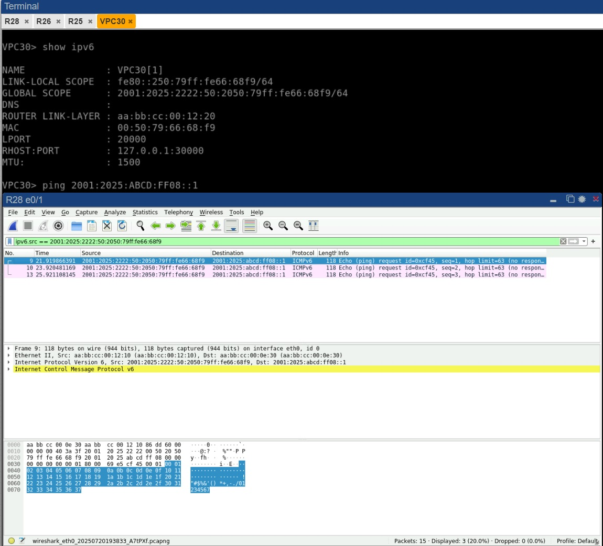

## PBR

### Цели:
1) Настроить политику маршрутизации в офисе Чокурдах;
2) Распределить трафик между 2 линками.


**Шаг 1. Настроить политику маршрутизации для сетей офиса**

В офисе Чокурдах у меня есть 2 сети:
1) VLAN 50 - 2001:2025:2222:50::/64
2) VLAN 60 - 2001:2025:2222:60::/64

В прошлой лабораторной работе была настроена адрессация, sub-интерфейсы, VPC получают адреса по SLAAC.

**Шаг 2. Распределить трафик между двумя линками с провайдером**

С помощью PBR я настрою роутинг таким образом, что если трафик приходит из подсети 2001:2025:2222:50::/64, R28 будет отправлять его  на R25.q  А если пакеты будут из подсети 2001:2025:2222:60::/64, в таком случае они будут отправляться на R26.
```
R28(config)#ipv6 access-list PBR-50
R28(config-ipv6-acl)#permit ip 2001:2025:2222:0050::/64 any
R28(config-ipv6-acl)#exit 
R28(config)#route-map PBR-50 permit 10
R28(config-route-map)#match ipv6 address PBR-50 
R28(config-route-map)# set ipv6 next-hop 2001:2025:ABCD:FF07::1
R28(config-route-map)#int Ethernet0/2.50
R28(config-subif)#ipv6 policy route-map PBR-50
R28(config-subif)#exit
R28(config)#ipv6 access-list PBR-60
R28(config-ipv6-acl)#permit ip 2001:2025:2222:0060::/64 any
R28(config-ipv6-acl)#exit 
R28(config)#route-map PBR-60 permit 10
R28(config-route-map)#match ipv6 address PBR-60 
R28(config-route-map)# set ipv6 next-hop 2001:2025:ABCD:FF08::1
R28(config-route-map)#int Ethernet0/2.60
R28(config-subif)#ipv6 policy route-map PBR-50
```

Далее, для проверки, отправим ICMP с VPC30 на адрес интерфейса e0/1 роутера R26 и снимим трафик с помощью Wireshark. Если бы не было PBR, роутер R28 увидел бы, что адрес интерфейса e0/1 роутера R26 доступен у него через интерфейс e0/0, но так как у нас в настройках PBR указан next hop в лице роутера R25, роутер R28 отправит такой пакет в интерфейс e0/1 вместо e0/0.



Как можем увидеть, PBR отрабатывает корректно.

**Шаг 3. Настроить для офиса Лабытнанги маршрут по-умолчанию**
```
R27(config)#do sh ipv6 int br
Ethernet0/0            [up/up]
    FE80:5555::2
    2001:2025:ABCD:FF06::
Ethernet0/1            [administratively down/down]
    unassigned
Ethernet0/2            [administratively down/down]
    unassigned
Ethernet0/3            [administratively down/down]
    unassigned
Ethernet1/0            [administratively down/down]
    unassigned
Ethernet1/1            [administratively down/down]
    unassigned
Ethernet1/2            [administratively down/down]
    unassigned
Ethernet1/3            [administratively down/down]
    unassigned
R27(config)#
R27(config)#
R27(config)#
R27(config)#ipv6 route ::/0 2001:2025:ABCD:FF06::1
R27(config)#do sh ipv6 route
IPv6 Routing Table - default - 4 entries
Codes: C - Connected, L - Local, S - Static, U - Per-user Static route
       B - BGP, HA - Home Agent, MR - Mobile Router, R - RIP
       H - NHRP, I1 - ISIS L1, I2 - ISIS L2, IA - ISIS interarea
       IS - ISIS summary, D - EIGRP, EX - EIGRP external, NM - NEMO
       ND - ND Default, NDp - ND Prefix, DCE - Destination, NDr - Redirect
       RL - RPL, O - OSPF Intra, OI - OSPF Inter, OE1 - OSPF ext 1
       OE2 - OSPF ext 2, ON1 - OSPF NSSA ext 1, ON2 - OSPF NSSA ext 2
       la - LISP alt, lr - LISP site-registrations, ld - LISP dyn-eid
       lA - LISP away, a - Application
S   ::/0 [1/0]
     via 2001:2025:ABCD:FF06::1
C   2001:2025:ABCD:FF06::/127 [0/0]
     via Ethernet0/0, directly connected
L   2001:2025:ABCD:FF06::/128 [0/0]
     via Ethernet0/0, receive
L   FF00::/8 [0/0]
     via Null0, receive
R27(config)#
```