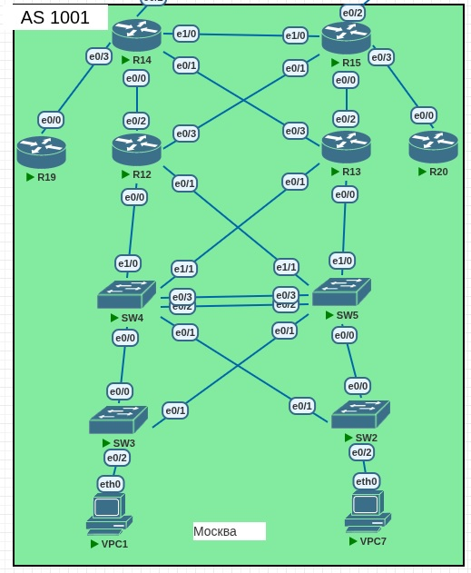

## OSPF

### Цели:
1) Настроить OSPF офисе Москва;
2) Разделить сеть на зоны;
3) Настроить фильтрацию между зонами.

### Топология Москвы


**Шаг 1. Настроить маршрутизаторы R14-R15 находятся в зоне 0 - backbone**
```
R14(config)#router ospfv3 1
R14(config-router)#router-id 1.1.1.1
R14(config-router)#interface Et1/0
R14(config-if)#ipv6 ospf 1 area 0
R14(config-if)#
*Jul 30 19:50:16.136: %OSPFv3-5-ADJCHG: Process 1, IPv6, Nbr 2.2.2.2 on Ethernet1/0 from LOADING to FULL, Loading Done
R14(config-if)#end
R14#sh ipv6 ospf neighbor 

            OSPFv3 Router with ID (1.1.1.1) (Process ID 1)

Neighbor ID     Pri   State           Dead Time   Interface ID    Interface
2.2.2.2           1   FULL/DR         00:00:39    7               Ethernet1/0

```

```
R15(config)#router ospfv3 1
R15(config-router)#router-id 2.2.2.2
R15(config-router)#interface Et1/0
R15(config-if)#ipv6 ospf 1 area 0
R15(config-if)#end
R15(config)# 
*Jul 30 19:50:16.136: %OSPFv3-5-ADJCHG: Process 1, IPv6, Nbr 1.1.1.1 on Ethernet1/0 from LOADING to FULL, Loading Done
R15(config)#do sh ipv6 ospf neighbor

            OSPFv3 Router with ID (2.2.2.2) (Process ID 1)

Neighbor ID     Pri   State           Dead Time   Interface ID    Interface
1.1.1.1           1   FULL/BDR        00:00:34    7               Ethernet1/0

```

**Шаг 2. Настроить маршрутизаторы R12-R15. Маршрутизаторы R12-R13 находятся в зоне 10. Дополнительно к маршрутам должны получать маршрут по умолчанию.**

```
R14(config)#interface range Ethernet0/0 , Ethernet0/1
R14(config-if-range)#ipv6 ospf 1 area 10
```

```
R15(config)#interface range Ethernet0/0 , Ethernet0/1
R15(config-if-range)#ipv6 ospf 1 area 10
```

```
R12(config-if-range)#interface range Ethernet0/2 , Ethernet0/3
R12(config-if-range)#ipv6 ospf 1 area 10                      
R12(config-if-range)#
*Jul 30 20:05:53.862: %OSPFv3-5-ADJCHG: Process 1, IPv6, Nbr 2.2.2.2 on Ethernet0/3 from LOADING to FULL, Loading Done
*Jul 30 20:05:54.281: %OSPFv3-5-ADJCHG: Process 1, IPv6, Nbr 1.1.1.1 on Ethernet0/2 from LOADING to FULL, Loading Done
```
```
R13(config)#router ospfv3 1
R13(config-router)#router-id 4.4.4.4
R13(config-router)#interface range Ethernet0/2 , Ethernet0/3
R13(config-if-range)#ipv6 ospf 1 area 10 
R13(config-if-range)#
*Jul 30 20:12:41.896: %OSPFv3-5-ADJCHG: Process 1, IPv6, Nbr 1.1.1.1 on Ethernet0/3 from LOADING to FULL, Loading Done
*Jul 30 20:12:41.896: %OSPFv3-5-ADJCHG: Process 1, IPv6, Nbr 2.2.2.2 on Ethernet0/2 from LOADING to FULL, Loading Done
```

Далее, настроим в 1 процессе ospfv3 default-information originate на R14 и R15. 
```
R14(config)#router ospfv3 1
R14(config-router)#address-family ipv6 unicast
R14(config-router-af)#default-information originate always 
```
```
R15(config)#router ospfv3 1
R15(config-router)#address-family ipv6 unicast
R15(config-router-af)#default-information originate always
```
Как можем увидеть на примере R13, роутер получает маршрут по умолчанию с двух роутеров с равно стоимостью, поэтому включается ECMP (аппаратная балансировка между двумя роутерами. Таким образом у нас используется максимальное количество линков. А в случае, если один из роутеров сломается, маршрут пропадёт и весь трафик пойдёт на оставшийся роутер. Часто пользуюсь этой схемой на работе при построении мультисайтовых anycast-сервисов, только там используется BGP).
```
R13#sh ipv6 route 
IPv6 Routing Table - default - 15 entries
Codes: C - Connected, L - Local, S - Static, U - Per-user Static route
       B - BGP, HA - Home Agent, MR - Mobile Router, R - RIP
       H - NHRP, I1 - ISIS L1, I2 - ISIS L2, IA - ISIS interarea
       IS - ISIS summary, D - EIGRP, EX - EIGRP external, NM - NEMO
       ND - ND Default, NDp - ND Prefix, DCE - Destination, NDr - Redirect
       RL - RPL, O - OSPF Intra, OI - OSPF Inter, OE1 - OSPF ext 1
       OE2 - OSPF ext 2, ON1 - OSPF NSSA ext 1, ON2 - OSPF NSSA ext 2
       la - LISP alt, lr - LISP site-registrations, ld - LISP dyn-eid
       lA - LISP away, a - Application
OE2 ::/0 [110/1], tag 1
     via FE80:1111::3, Ethernet0/3
     via FE80:1111::4, Ethernet0/2
O   2001:2025:1111:2::/127 [110/20]
     via FE80:1111::3, Ethernet0/3
O   2001:2025:1111:3::/127 [110/20]
     via FE80:1111::4, Ethernet0/2
C   2001:2025:1111:4::/127 [0/0]
     via Ethernet0/2, directly connected
L   2001:2025:1111:4::1/128 [0/0]
     via Ethernet0/2, receive
C   2001:2025:1111:5::/127 [0/0]
     via Ethernet0/3, directly connected
```

**Шаг 3. Настроить маршрутизаторы R14, R19. Маршрутизатор R19 находится в зоне 101 и получает только маршрут по умолчанию.**

```
R14(config-router)#int Et0/3       
R14(config-if)#ipv6 ospf 1 area 101
R14(config-if)#
*Jul 31 11:28:33.147: %OSPFv3-5-ADJCHG: Process 1, IPv6, Nbr 5.5.5.5 on Ethernet0/3 from LOADING to FULL, Loading Done
```

```
R19(config-router)#int Et0/0            
R19(config-if)#ipv6 ospf 1 area 101
R19(config-if)#
*Jul 31 11:28:33.147: %OSPFv3-5-ADJCHG: Process 1, IPv6, Nbr 1.1.1.1 on Ethernet0/0 from LOADING to FULL, Loading Done
```

Теперь настроим 101 зону как totaly stub и проверим таблицу маршрутизации на R19.

```
R14(config-router)#area 101 stub no-summary 
```

```
R19(config-router)#router ospfv3 1 
R19(config-router)#area 101 stub no-summary 
R19(config-router)#do sh ipv6 route                                   
IPv6 Routing Table - default - 5 entries
Codes: C - Connected, L - Local, S - Static, U - Per-user Static route
       B - BGP, HA - Home Agent, MR - Mobile Router, R - RIP
       H - NHRP, I1 - ISIS L1, I2 - ISIS L2, IA - ISIS interarea
       IS - ISIS summary, D - EIGRP, EX - EIGRP external, NM - NEMO
       ND - ND Default, NDp - ND Prefix, DCE - Destination, NDr - Redirect
       RL - RPL, O - OSPF Intra, OI - OSPF Inter, OE1 - OSPF ext 1
       OE2 - OSPF ext 2, ON1 - OSPF NSSA ext 1, ON2 - OSPF NSSA ext 2
       la - LISP alt, lr - LISP site-registrations, ld - LISP dyn-eid
       lA - LISP away, a - Application
OI  ::/0 [110/11]
     via FE80:1111::3, Ethernet0/0
C   2001:2025:1111:6::/127 [0/0]
     via Ethernet0/0, directly connected
L   2001:2025:1111:6::/128 [0/0]
     via Ethernet0/0, receive
LC  2001:DEAD:BEEF::5/128 [0/0]
     via Loopback1, receive
L   FF00::/8 [0/0]
     via Null0, receive
```

**Шаг 4. Настроить маршрутизаторы R15, R20. Маршрутизатор R20 находится в зоне 102 и получает все маршруты, кроме маршрутов до сетей зоны 101..**

Настроим фильтрацию маршрутов, чтобы роутер R20 не получал от R15 только маршруты до сетей роутера R19 (area 101).

```
R15(config)#ipv6 prefix-list DENY-AREA101 seq 5 deny 2001:2025:1111:0006::/127        
R15(config)#ipv6 prefix-list DENY-AREA101 seq 10 deny 2001:dead:beef::5/128
R15(config)#ipv6 prefix-list DENY-AREA101 seq 15 permit ::/0 le 128
R15(config)#
R15(config)#router ospfv3 1
R15(config-router)#address-family ipv6 unicast
R15(config-router-af)#area 102 filter-list prefix DENY-AREA101 in
```

```
R20(config)#do sh ipv6 route
IPv6 Routing Table - default - 10 entries
Codes: C - Connected, L - Local, S - Static, U - Per-user Static route
       B - BGP, HA - Home Agent, MR - Mobile Router, R - RIP
       H - NHRP, I1 - ISIS L1, I2 - ISIS L2, IA - ISIS interarea
       IS - ISIS summary, D - EIGRP, EX - EIGRP external, NM - NEMO
       ND - ND Default, NDp - ND Prefix, DCE - Destination, NDr - Redirect
       RL - RPL, O - OSPF Intra, OI - OSPF Inter, OE1 - OSPF ext 1
       OE2 - OSPF ext 2, ON1 - OSPF NSSA ext 1, ON2 - OSPF NSSA ext 2
       la - LISP alt, lr - LISP site-registrations, ld - LISP dyn-eid
       lA - LISP away, a - Application
OE2 ::/0 [110/1], tag 1
     via FE80:1111::4, Ethernet0/0
OI  2001:2025:1111:2::/127 [110/30]
     via FE80:1111::4, Ethernet0/0
OI  2001:2025:1111:3::/127 [110/20]
     via FE80:1111::4, Ethernet0/0
OI  2001:2025:1111:4::/127 [110/20]
     via FE80:1111::4, Ethernet0/0
OI  2001:2025:1111:5::/127 [110/30]
     via FE80:1111::4, Ethernet0/0
C   2001:2025:1111:7::/127 [0/0]
     via Ethernet0/0, directly connected
L   2001:2025:1111:7::/128 [0/0]
     via Ethernet0/0, receive
OI  2001:2025:1111:8::/127 [110/20]
     via FE80:1111::4, Ethernet0/0
LC  2001:DEAD:BEEF::6/128 [0/0]
     via Loopback1, receive
L   FF00::/8 [0/0]
     via Null0, receive

```

Как можно увидеть, отсутствуют маршруты до сети 2001:2025:1111:0006::/127 и до loopback-интерфейса R19.