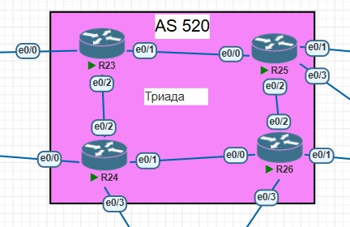

## IS-IS

### Цели:
1) Настроите IS-IS в ISP Триада;
2) R23 и R25 находятся в зоне 2222;
3) R24 находится в зоне 24;
4) R26 находится в зоне 26.

### Топология Триады


Итоговая конфигурация устройств.

Настройка IS-IS на маршрутизаторе R23
```
R23(config)#router isis
R23(config-router)# net 49.2222.0000.0000.0023.00
R23(config-router)# metric-style wide
R23(config-router)#address-family ipv6
R23(config-router-af)# multi-topology
R23(config-router-af)#address-family ipv6 unicast
R23(config-router-af)# multi-topology            
R23(config-router-af)#interface Ethernet0/1
R23(config-if)# ipv6 router isis 
R23(config-if)# isis network point-to-point 
R23(config-if)#interface Ethernet0/2        
R23(config-if)# ipv6 router isis 
R23(config-if)# isis network point-to-point 
```

Настройка IS-IS на маршрутизаторе R24

```
R24(config)#router isis
R24(config-router)#net 49.0024.0000.0000.0024.00
R24(config-router)#metric-style wide
R24(config-router)#address-family ipv6
R24(config-router-af)#multi-topology
R24(config-router-af)#address-family ipv6 unicast
R24(config-router-af)#multi-topology  
R24(config-router-af)#interface Ethernet0/1
R24(config-if)#ipv6 router isis
R24(config-if)#isis network point-to-point 
R24(config-if)#interface Ethernet0/2       
R24(config-if)#ipv6 router isis            
R24(config-if)#isis network point-to-point 
R24(config-if)#
```

Настройка IS-IS на маршрутизаторе R25
```
R25(config)#router isis
R25(config-router)#net 49.2222.0000.0000.0025.00
R25(config-router)#metric-style wide 
R25(config-router)#
R25(config-router)#address-family ipv6
R25(config-router-af)#multi-topology
R25(config-router-af)#int Et0/0
R25(config-if)#ipv6 router isis
R25(config-if)#isis network point-to-point 
R25(config-if)#int Et0/2                   
R25(config-if)#ipv6 router isis            
R25(config-if)#isis network point-to-point 
```

Настройка IS-IS на маршрутизаторе R26
```
R26(config)#router isis
R26(config-router)#net 49.0026.0000.0000.0026.00 
R26(config-router)#metric-style wide
R26(config-router)#address-family ipv6
R26(config-router-af)#multi-topology
R26(config-router-af)#int Et0/0
R26(config-if)#ipv6 router isis
R26(config-if)#isis network point-to-point
R26(config-if)#int Et0/2  
R26(config-if)#isis network point-to-point
R26(config-if)#ipv6 router isis  
```

После этого, проверим установку соседства на всех роутерах.

```
R23#sh isis neighbors 

System Id       Type Interface     IP Address      State Holdtime Circuit Id
R24             L2   Et0/2                         UP    29       00
R25             L1L2 Et0/1                         UP    27       00
```

```
R24#sh isis neighbors 

System Id       Type Interface     IP Address      State Holdtime Circuit Id
R23             L2   Et0/2                         UP    25       00
R26             L2   Et0/1                         UP    26       00
```

```
R25#sh isis neighbors 

System Id       Type Interface     IP Address      State Holdtime Circuit Id
R23             L1L2 Et0/0                         UP    28       01
R26             L2   Et0/2                         UP    21       01
```

```
R26#sh isis neighbors 

System Id       Type Interface     IP Address      State Holdtime Circuit Id
R24             L2   Et0/0                         UP    24       01
R25             L2   Et0/2                         UP    24       01
```