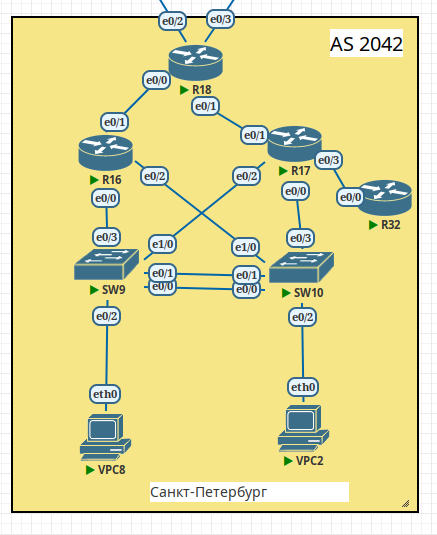

## EIGRP

### Цели:
1) В офисе Санкт-Петербург настроить EIGRP;
2) R32 получает только маршрут по умолчанию;
3) R16-17 анонсируют только суммарные префиксы;
4) Использовать EIGRP named-mode для настройки сети.

### Топология Санкт-Петербурга


Итоговая конфигурация устройств.

Настройка EIGRP на маршрутизаторе R16
```
```

Настройка EIGRP на маршрутизаторе R17

```
```

Настройка EIGRP на маршрутизаторе R18
```
```

Настройка EIGRP на маршрутизаторе R32
```
```
